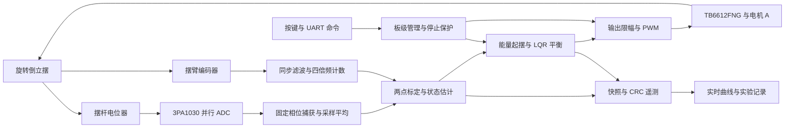

# J280 旋转倒立摆 FPGA 姿态控制系统

> 全国大学生嵌入式芯片与系统设计竞赛 2026 FPGA 创新设计赛道 · 高云选题一
>
> 官方 J280 开发板 + 官方倒立摆套件 · GW2A-LV55PG484C8/I7（GW2A-55C）

## 项目简介

本项目在 FPGA 内实现旋转倒立摆的采集、状态估计、自动起摆和直立平衡。控制链路使用确定的 1 ms 节拍，结合能量起摆与四状态 LQR 反馈，并通过板载串口输出带 CRC 校验的遥测数据。

当前版本 **v0.2.0** 已完成图形上位机、实验记录及回放，FPGA 沿用 **v0.1.1** 控制基线和既有仿真/构建证据。实物已有，但机械参数、反馈方向和安装尚未测量，**基础功能与物理串口仍需上板验收**。定点调节和速度轨迹属于后续拓展。硬件限定现有官方 J280 与倒立摆套件，不增加硬件。

| 项目 | 当前配置 |
| --- | --- |
| FPGA / 系统时钟 | GW2A-LV55PG484C8/I7 / 50 MHz |
| 摆杆角度采集 | 3PA1030，10 位并行 ADC；WDD35D4 电位器 |
| 编码器 | A/B 正交四倍频，默认 1040 counts/rev 为资料推导值，待实测 |
| 控制 / PWM 节拍 | 1 kHz 状态更新 / 20 kHz PWM |
| 通信 | 板载 UART，115200 bps、8N1，约 50 Hz 遥测 |
| 板级约束 | 29 个独立引脚，按官方资料核验；完整依据见技术文档 |

## 系统结构



内部逻辑共用 50 MHz 时钟，通过使能信号按节拍工作。采样、估计、控制和输出之间使用寄存器传递数据，标定、停止和保护由顶层协调。电机 B 保持停止。

## 模块职责

| 模块 / 源文件 | 职责 |
| --- | --- |
| [top.v](Attitude_Control/src/top.v) | 板级连接、命令映射、运行许可、停止门与限时点动 |
| [adc_sampler.v](Attitude_Control/src/adc_sampler.v) | 5 MHz ADC 时钟、固定相位捕获、启动丢弃、16 次采样平均 |
| [quadrature_encoder.v](Attitude_Control/src/quadrature_encoder.v) | 两级同步、8 拍滤波、四倍频计数及非法转换检测 |
| [state_estimator.v](Attitude_Control/src/state_estimator.v) / [calibration_divider.v](Attitude_Control/src/calibration_divider.v) | 两点标定、角度映射、Q10 四状态、差分与 IIR 速度估计 |
| [attitude_controller.v](Attitude_Control/src/attitude_controller.v) | IDLE / SWING / BALANCE / FAULT 状态机、能量起摆、LQR、捕获及保护 |
| [motor_pwm.v](Attitude_Control/src/motor_pwm.v) | 20 kHz PWM、周期边界更新、换向空白、高阻停止 |
| [uart_rx_byte.v](Attitude_Control/src/uart_rx_byte.v) / [uart_tx_byte.v](Attitude_Control/src/uart_tx_byte.v) | UART 命令接收与字节发送 |
| [telemetry.v](Attitude_Control/src/telemetry.v) | 一致状态快照、24 字节帧和 CRC16/CCITT-FALSE |
| [host](host/README.md) | 图形上位机、串口解析、实验指标与记录回放 |
| [reset_sync.v](Attitude_Control/src/reset_sync.v) / [key_debounce.v](Attitude_Control/src/key_debounce.v) | 复位同步释放及按键消抖 |

## 控制方法与工程特点

### 能量起摆与直立捕获

自然下垂静止时先施加短时激励，随后根据摆杆角度、角速度和能量缺额选择泵入或抽取能量的方向。满足捕获条件后进入平衡；起摆超时、位置/速度越界、采样异常和丢失均可撤销驱动。

### 四状态反馈与捕获渐入

反馈使用摆杆角度、摆杆角速度、摆臂相对捕获位置和摆臂速度。捕获后位置刚度按每 128 ms 的 25%、50%、75%、100% 渐入，384 ms 达到全量；速度阻尼保持全量，以减小切换冲击。

### 定点单位与时序收敛

角度和速度使用 signed Q10，PWM 指令使用千分比。能量乘积显式扩展到 64 位；余弦索引采用精确倒数校正和流水化，PWM 比例先约分，缩短关键路径。16 次 ADC 整数码求和用于平均，不宣称获得新的 14 位 ADC 分辨率。

### 停止与诊断

停止具有优先级，SW3 另有直接关闭驱动的路径；运行中检测过量程、非法编码器转换、超时和跌落。CRC 遥测与 CSV 工具提供状态、控制指令和故障信息，便于分析同一固件配置下的实验结果。现有套件没有电流测量接口。

## 赛题覆盖与验证

| 赛题功能 | 代码与仿真状态 | 实物状态 |
| --- | --- | --- |
| 自然下垂自动起摆 | 已实现，指定模型真实 RTL 闭环通过 | 待标定与重复起摆验证 |
| 持续直立、稳态少震荡 | 已实现，指定模型持续保持 | 待长时记录 |
| 轻推后恢复 | 已实现，模型扰动后恢复 | 待现场验证 |
| 平衡中摆臂定点调节 | 未实现 | 后续拓展 |
| 速度曲线与轨迹跟随 | 未实现 | 后续拓展 |

### 指定模型的 RTL 闭环结果

实际估算器、控制器和 PWM 与非线性动力学模型闭环，包含 ADC 量化、16 次采样及编码器量化。示例安装相位为 210°、`THETA_SIGN=-1`，机械参数来自待辨识假设；工程默认方向不代表实物方向已确认。

| 仿真指标 | 结果 |
| --- | --- |
| 仿真长度 | 12.000 s |
| 首次捕获 / 捕获次数 | 0.769000 s / 1 |
| 最后 2 s 最大绝对倾角 | 0.687076° |
| 模型扰动 | 0.01 N·m，持续 50 ms |
| 扰动峰值 / 恢复时间 | 2.790448° / 0.353000 s |

恢复定义为扰动结束后进入 ±2° 并连续维持 500 ms。这些数值为内部仿真判据，赛题没有规定相同数值。测试采用时间缩放，未将全部物理顶层引脚纳入动力学闭环；结果不是实物 HIL，也不能替代上板录像与遥测。

### 构建与回归记录

| 检查 | 已记录结果 |
| --- | --- |
| 已提交控制基线的 Python 测试 | 10 项通过 |
| v0.2.0 Python 软件回归 | 65 项通过，无跳过（新增上位机 55 项） |
| Windows 图形上位机 | 源码与 EXE 离线自检通过，物理串口待验 |
| RTL 自检 | 5 组通过：接口、估计器、控制器、顶层、非线性闭环 |
| 官方资料 / 工程引脚 | 31 份本地资料校验通过 / 29 个管脚及电压标准核对一致 |
| 50 MHz 时序 | Setup / Hold 违例端点均为 0，Fmax 50.966 MHz |
| Logic / Register / DSP | 2894/54720；1322/42000；14.5/20 |

验证环境、模型限制及源码/位流哈希见 [验证记录](docs/验证记录.md) 和 [构建证据](docs/build_validation.json)。这些记录对应已验证的控制基线，后续扩展以更新后的实际验证记录为准。

## 开发环境与复现

### 图形上位机

本机 v0.2.0 发布包位于 `Release/v0.2.0/J280_Monitor.exe`，可直接运行，无需 Python；“查看演示数据”可离线体验。EXE 为本地产物，源码克隆后可按上位机 README 构建。提供 ADC、姿态/估计角速度、控制指令曲线，标定与限时点动，实验事件、平衡/恢复指标、CSV 记录与回放、截图和通信诊断。后续目标轨迹、观测与诊断字段在扩展页显示，当前固件未上报的量保持“未提供”。

完整使用说明见 [host/README.md](host/README.md)，接口见 [PROTOCOL](host/PROTOCOL.md)，类似工程比较见 [GitHub 调研](docs/上位机参考工程调研.md)。源码从 `Project` 执行：

```powershell
python -m pip install -r host/requirements.txt
python tools/host_monitor.py --demo
```

现场硬件操作与实物测量以本地 `用户手册.md` 为准；软件使用说明在上位机目录独立维护。

控制基线使用 Python 3.12、NumPy、SciPy、Icarus Verilog 12.0 和 Gowin V1.9.12.03。Python 依赖见 [requirements-dev.txt](requirements-dev.txt)。在 `Project` 仓库根执行开发检查：

```powershell
python -m pip install -r requirements-dev.txt
python -m pip install -r host/requirements.txt
python tools/verify_project.py
python tools/run_tests.py --iverilog "Icarus 的 bin 目录"
python tools/build.py --gw-sh "Gowin 安装目录/IDE/bin/gw_sh.exe"
```

本机 Icarus 位于 `.tools/iverilog/bin`，不随仓库分发。工程入口为 [Attitude_Control.gprj](Attitude_Control/Attitude_Control.gprj)。构建脚本显式启用 T20 的 SSPI GPIO 复用，并检查引脚与时序；通过后本地 `Release` 保留位流和报告。硬件操作与交接资料在开发机器单独维护。

## 目录与文档

工作区一级仅有 `Project` 和 `Reference`；`Project` 是唯一 Git 仓库根，官方资料在同级 `Reference`，不纳入仓库。

```text
Project/
├── README.md                 项目总览、架构、验证与路线
├── Attitude_Control/         Gowin 工程、RTL、CST、SDC
├── tools/                    模型、构建、自检及串口工具
├── host/                     图形上位机、使用 README 与升级协议
├── tests/                    Python 与 RTL 自检
├── docs/                     资料校验与验证证据
├── 开发项目技术文档.md        算法、接口、引脚与时序依据
├── 交接文档.md                本地开发复现、状态与后续待办，不上传
├── AGENTS.md                  本地协作约束，不上传
├── CHANGELOG.md               版本更新及解决的问题
├── 用户手册.md                本地硬件操作、测量与验证记录，不上传
└── Release/                   本地位流、报告及实验数据，不上传
Reference/                     同级官方资料，不上传
```

| 文档 | 读者与用途 |
| --- | --- |
| README | 仓库读者了解能力、结构、证据与路线 |
| [开发项目技术文档](开发项目技术文档.md) | 开发者核查算法、接口、定点格式与板级依据 |
| `交接文档.md`（仅本地） | 接手者复现工程、确认状态并安排后续工作 |
| `用户手册.md`（仅本地） | 实际操作者完成连接、下载、标定、参数测量、运行与记录 |
| [上位机 README](host/README.md) | 软件使用、记录、回放与数据边界 |

用户手册、交接文档和 Agent 指令文件在本地持续维护，不随 Git 分发；移交开发机器时需单独传递。官方资料、工具安装和生成产物需另行配置。

## 当前不足

- 实物已有，但尚未测量机械尺寸、质量、阻尼、编码器单圈计数与控制方向；默认增益来自标称模型，不能直接保证上板平衡。
- WDD35D4 电气行程约 345°，存在盲区。两点标定只确定零位和比例；必须检查完整起摆轨迹是否跨越盲区。当前遇显著采样跳变会保护停机。
- 成功闭环模型的示例安装使用 `THETA_SIGN=-1`；工程默认为 `+1`。须现场辨识后配置，不能直接套用仿真方向。
- ADC 外部延时约束包含板级预算假设，需要检查实物波形。没有电流测量接口，现有保护不能替代电机与驱动的额定限制。
- 尚无长期运行、重复起摆成功率、温升、扰动强度和恢复时间的实物数据；拓展要求仍未实施。

## 后续路线

1. 在现有 J280 套件上完成两点标定、编码器单圈与三方向核验，记录安装相位及完整运动范围。
2. 根据实测机械参数重新计算增益，完成重复自动起摆、持续平衡与轻推恢复，并保存 CSV 和录像。
3. 实现平衡中摆臂定点调节，加入速度/加速度受限的目标斜坡。
4. 实现速度曲线与轨迹跟随，验证全程直立、停止平滑与扰动恢复。

## 全部赛题要求完成后的创新方案

创新继续使用当前开发板、传感器和电机，不增加硬件。建议先完成一项有实测对照的改进，再扩展功能数量。

| 方向 | 实现思路 | 可量化收益 |
| --- | --- | --- |
| 自适应参数辨识 | 受限激励下用现有 ADC/编码器记录响应，在 FPGA 中递推估计摩擦与等效阻尼 | 不同负载下的起摆成功率、误差与调参时间 |
| 盲区状态观测 | 在现有传感器基础上预测短时角度，加入置信度、可观测性判定与保守退化策略 | 无效采样容忍时间、误差上界与保护正确率 |
| 约束轨迹控制 | 针对现有电压、角度与速度限制实现参考治理或小规模 MPC | 大位移跟踪时的最大倾角、饱和时间与定位误差 |
| 扰动观测与增益调度 | 用姿态及编码器残差估计外部扰动，在捕获与稳态间连续调度参数 | 扰动峰值、恢复时间和稳态噪声 |
| 在线诊断与可复现实验 | 通过现有 UART 输出事件、参数版本和统一实验记录 | 故障定位时间、重复实验一致性与交接效率 |

## 参考与版本

主要硬件依据为本地官方 `Interface_test`、J280 手册和原理图。相关 [同届旋转倒立摆开源项目](https://github.com/pjj644/gowin-furuta-pendulum) 可用于比较能量起摆与全状态反馈思路；其 ADC 类型、编码器参数和管脚配置与本地资料不一致。本项目使用独立适配的工程和验证记录。

版本通过 Git 管理。提交和 CHANGELOG 记录功能更新、根因修复及验证范围；上板测量完成后另发布实测版本。
