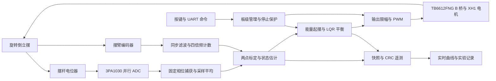

# J280 旋转倒立摆 FPGA 姿态控制系统

> 全国大学生嵌入式芯片与系统设计竞赛 2026 FPGA 创新设计赛道 · 高云选题一
>
> 官方 J280 开发板 + 官方倒立摆套件 · GW2A-LV55PG484C8/I7（GW2A-55C）

## 项目简介

当前开发交付为 **project-v0.3.0 + host-v0.7.0**。ADC 增加低延迟去尖峰控制分支，并把水平位置的 0↔1023 盲区与硬故障分开。手扶经过盲区不再锁 `0x01`；回到有效直立区后自动恢复测量，新的 H 请求才接管。原始均值与控制均值分别显示和记录，见 [ADC 去尖峰与水平盲区](docs/ADC去尖峰与水平盲区.md)。

本阶段目标为让已能松手保持的摆臂尽量静止：连续 60 秒，末 20 秒摆臂峰峰值 ≤5°，再争取 ≤2°；摆杆相对标定零点 RMS ≤2°，连续 3 次。旧日志仍有明显往返，当前没有新版上板数据。H 参数保持 S120，不把去尖峰宣称为已经解决慢周期摆动；量化基线及验收见 [H 稳定目标](docs/H稳定目标与日志基线.md)。这些是项目内部目标，手扶 H 不替代赛题的自动起摆要求。

本版 453 项 Python 测试、31 个 RTL 测试、源码与 EXE 启动检查通过；真实顶层 UART 与上位机交叉核对 38 帧实时遥测及 290 行控制记录。50 MHz 构建 setup/hold 违例均为 0，Fmax 为 50.072 MHz。验证结果见 [project-v0.3.0](docs/project-v0.3.0_validation.json)。历史发布和现场观察见 [CHANGELOG](CHANGELOG.md)；旧版记录中的轨端故障及 R 恢复步骤仅适用于相应固件。

本项目在 FPGA 内实现旋转倒立摆的采集、状态估计、自动起摆和直立平衡。控制链路使用确定的 1 ms 节拍，结合能量起摆与四状态 LQR 反馈，并通过板载串口输出带 CRC 校验的遥测数据。

前版 **project-v0.2.0 + host-v0.6.0**：采样窗口质量与均值同步上报，待机/故障状态持续估速，16 个可信样本后允许控制启动；新增 H 直立接管和 v2 诊断遥测，主界面显示原始 ADC、窗口范围、标定端点、设备版本和首故障。自动运行日志仍独立保存在 captures/fpga_logs。官方 PID 位流在同一硬件下可松手平衡由用户确认；本工程的实际控制方向、持续平衡、自动起摆和抗扰仍待实物验收。重构依据、三篇资料的访问结果及替代控制路线见 [ADC 重构与官方 PID 对照](docs/ADC重构与官方PID对照.md)。

| 项目 | 当前配置 |
| --- | --- |
| FPGA / 系统时钟 | GW2A-LV55PG484C8/I7 / 50 MHz |
| 摆杆角度采集 | 3PA1030，10 位并行 ADC；WDD35D4 电位器 |
| 编码器 | A/B 正交四倍频，默认 1040 counts/rev 为资料推导值，待实测 |
| 控制 / PWM 节拍 | 1 kHz 状态更新 / 20 kHz PWM |
| 通信 | 板载 UART，115200 bps、8N1，约 50 Hz 遥测 |
| 板级约束 | 29 个独立引脚，按官方资料核验；完整依据见技术文档 |

## 系统结构



内部逻辑共用 50 MHz 时钟，通过使能信号按节拍工作。采样、估计、控制和输出之间使用寄存器传递数据，标定、停止和保护由顶层协调。XH1 电机与编码器 1 配对，未使用的 XH2 / TB6612 A 桥保持高阻停止。

## 模块职责

| 模块 / 源文件 | 职责 |
| --- | --- |
| [top.v](Attitude_Control/src/top.v) | 板级连接、命令映射、运行许可、停止门与限时点动 |
| [adc_sampler.v](Attitude_Control/src/adc_sampler.v) | 5 MHz 固定相位捕获、七点中值、突变确认、独立原始/控制均值、盲区及硬故障分类 |
| [quadrature_encoder.v](Attitude_Control/src/quadrature_encoder.v) | 两级同步、8 拍滤波、四倍频计数及非法转换检测 |
| [state_estimator.v](Attitude_Control/src/state_estimator.v) / [calibration_divider.v](Attitude_Control/src/calibration_divider.v) | 两点标定、角度映射、Q10 四状态、差分与 IIR 速度估计 |
| [attitude_controller.v](Attitude_Control/src/attitude_controller.v) | IDLE / SWING / BALANCE / FAULT 状态机、能量起摆、LQR、捕获及保护 |
| [motor_pwm.v](Attitude_Control/src/motor_pwm.v) | 20 kHz PWM、周期边界更新、换向空白、高阻停止 |
| [motor_test.v](Attitude_Control/src/motor_test.v) | 定PWM测试，时限/位移/无编码器变化结束，停止与故障优先 |
| [uart_rx_byte.v](Attitude_Control/src/uart_rx_byte.v) / [uart_tx_byte.v](Attitude_Control/src/uart_tx_byte.v) | UART 命令接收与字节发送 |
| [telemetry.v](Attitude_Control/src/telemetry.v) | 一致快照、219 字节 v2 / 兼容24字节 v1、CRC16/CCITT-FALSE |
| [host](host/README.md) | 自定义串口、图形遥测、实测辅助、实验指标与记录回放 |
| [reset_sync.v](Attitude_Control/src/reset_sync.v) / [key_debounce.v](Attitude_Control/src/key_debounce.v) | 复位同步释放及按键消抖 |

## 控制方法与工程特点

### 能量起摆与直立捕获

新增 H 为独立直立接管入口，检查新鲜成熟测量及近直立低速条件后直接 BALANCE；拒收时不回退到 SWING。G 与板上 SW2 保持下垂自动起摆入口，两种路径分别验收。

自然下垂静止时先施加短时激励，随后根据摆杆角度、角速度和能量缺额选择泵入或抽取能量的方向。满足捕获条件后进入平衡；起摆超时、位置/速度越界、采样异常和丢失均可撤销驱动。

### 四状态反馈与捕获渐入

反馈使用摆杆角度、摆杆角速度、摆臂相对捕获位置和摆臂速度。捕获后位置刚度按每 128 ms 的 25%、50%、75%、100% 渐入，384 ms 达到全量；速度反馈项保持全量，以减小切换冲击。

### 定点单位与时序收敛

角度和速度使用 signed Q10，PWM 指令使用千分比。能量乘积显式扩展到 64 位；余弦索引采用精确倒数校正和流水化，PWM 比例先约分，缩短关键路径。ADC 连续窗口平均以 Q4 表示，不宣称获得新的 14 位 ADC 分辨率。

### 停止与诊断

停止具有优先级，SW3 另有直接关闭驱动的路径；运行中检测持续采样异常、非法编码器转换、超时和跌落；盲区另按测量不可用停止处理。FPGA 上报聚合故障、当前 SW3/ADC/接口/估计器标志以及最近一次 SW2/G 启动结果；上位机显示原因并保存原始诊断值，区分“电脑未发送”“板端拒收”和“已接受后故障”。所有状态均有 2 ms 有效采样看门狗；采样断流时禁止启动/点动和使用旧样本标定，仍定期发送故障状态，故障帧可保留最后可信角度，不能当作新测量。现有套件没有电流、温度或电源电压测量接口。

本轮按官方底板原理图第 1 页、PCB 连通分组第 2 页和用户手册 PDF 第 26～27 页交叉核验：`BN1/BN2/PWMB → BO1/BO2 → O1/O2 → XH1`，编码器为 `enc1`；`AN1/AN2/PWMA` 实际连接 XH2。旧版本将 XH1 编码器与 XH2 驱动配对，能解释启动后 XH1 电机不转；它不能单独解释仍停留待机的启动拒收。引脚和资料差异见技术文档。

## 赛题覆盖与验证

选题指南 PDF 第 14 页（印刷第 12 页）的基础要求为自然下垂起摆、长期直立平衡，以及捕获后少震荡和轻推后恢复。位置设定与速度/轨迹属于拓展。FPGA 承担实时采集、控制算法与 PWM，上位机承担操作、诊断、曲线和实验留证；串口与电脑不进入 1 kHz 控制计算链。

| 赛题功能 | 代码与仿真状态 | 实物状态 |
| --- | --- | --- |
| 自然下垂自动起摆 | 已实现，指定模型真实 RTL 闭环通过 | 待标定与重复起摆验证 |
| 持续直立、稳态少震荡 | 已实现，指定模型持续保持 | v0.2.4已松手保持；摆臂仍大幅往返，少震荡与长时验收未通过 |
| 轻推后恢复 | 已实现，模型扰动后恢复 | 待现场验证 |
| 平衡中摆臂定点调节 | 未实现 | 后续拓展 |
| 速度曲线与轨迹跟随 | 未实现 | 后续拓展 |

### 指定模型的 RTL 闭环结果

实际估算器、控制器和 PWM 与非线性动力学模型闭环，包含 ADC 量化、16 次采样及编码器量化。示例安装相位为 210°、`THETA_SIGN=-1`，机械参数来自待辨识假设；该测试的安装相位、ADC映射和测量符号与现场不同，且未实例化完整ADC采样与顶层OTR链；不能据其通过推断现场G可跨越轨端。

| 仿真指标 | 结果 |
| --- | --- |
| 仿真长度 | 12.000 s |
| 首次捕获 / 捕获次数 | 0.790000 s / 1 |
| 最后 2 s 最大绝对倾角 | 0.683502° |
| 模型扰动 | 0.01 N·m，持续 50 ms |
| 扰动峰值 / 恢复时间 | 3.781472° / 0.493000 s |

恢复定义为扰动结束后进入 ±2° 并连续维持 500 ms。这些数值为内部仿真判据，赛题没有规定相同数值。测试采用时间缩放，未将全部物理顶层引脚纳入动力学闭环；结果不是实物 HIL，也不能替代上板录像与遥测。

### 构建与回归记录

历史 project-v0.2.9：372项Python测试通过；真实顶层UART、完整4096行导出、坏包/断连、后台写盘与UI专项通过。修复立即重启H误冻结和冻结原因误判，冻结v0.2.8控制器逐拍对照通过。Gowin Fmax 52.140MHz，setup/hold为0/0，BSRAM为65/140。全部既有RTL测试在本轮已通过，记录边界修复后的相关测试另行复验；不把缩时接口仿真当作实物稳定性证明。 详见[本版验证](docs/project-v0.2.9_validation.json)。

前版 project-v0.2.6 / host-v0.6.5：284项Python测试、16个相关RTL测试台与Verilog-2005顶层通过；另6个未修改测试台该轮未重跑。Gowin Fmax **51.889MHz**、Setup/Hold **0/0**，源码与EXE离线启动检查通过。208字节合成遥测90秒共4500帧一致；交付最大141ms、S回调最大78ms。三组30秒真实RTL标称模型闭环通过，见[历史清单](docs/project-v0.2.6_validation.json)。当前版验证单独记录，不将这些历史结果视作当前源码重新通过。

前版 project-v0.2.4 / host-v0.6.4：253项Python测试通过；原始现场帧90秒离线回放4501帧输入/交付/日志一致，CRC/缺帧/积压溢出/超时均0，交付最高62ms，89次S回调最高47ms。该场景未复现旧会话界面积压，不能据此声称物理串口问题彻底解决。完整RTL与构建结果见[当前验证](docs/project-v0.2.4_validation.json)。后续v0.2.4现场已验证短驱动方向及H松手保持，振荡与长时验收仍未完成。

历史 project-v0.2.2 / host-v0.6.2：220项Python（其中202项host）、16组RTL、Verilog-2005顶层及源码/EXE启动检查通过。Gowin Fmax **51.893 MHz**，Setup/Hold **0/0**；Logic 5264/54720、Register 3483/42000、DSP 15/20。190字节离线90秒4500帧全部交付并记录，积压溢出0。详见[历史验证](docs/project-v0.2.2_validation.json)。

历史 project-v0.2.1 构建：Fmax **54.191 MHz**，Setup/Hold **0/0**，Logic 3775/54720、Register 2059/42000、DSP 15/20。**209 项 Python、15 组 RTL、源码与 Windows EXE 启动检查通过**。上位机预填 300 秒显示窗口后离线重放 90 秒，4500 帧全部交付并记录、积压溢出 0；不替代实物串口与运动验收。详见[前版验证](docs/project-v0.2.1_validation.json)。

历史 project-v0.2.0 Gowin 构建：Fmax **50.561 MHz**，Setup/Hold **0/0**，Logic 3348/54720、Register 1846/42000、DSP 15/20。**200 项 Python、14 组 RTL、源码及 Windows EXE 离线启动检查通过**；范围与文件校验见 [历史验证](docs/project-v0.2.0_validation.json)。以下为独立保存的历史版本结果。

host-v0.5.1 的 179 项软件测试及源码、EXE 离线启动检查通过，FPGA 保持 project-v0.1.3。已归档的 project-v0.1.3 / host-v0.5.0 基线为 Python 172 项与 EXE 离线启动检查通过，Gowin Fmax 50.395 MHz、Setup/Hold 0/0，9 组 RTL 回归全部通过。

| 检查 | 已记录结果 |
| --- | --- |
| host-v0.5.1 软件与 EXE | 179 项测试通过、无跳过；源码与 EXE 离线启动检查通过 |
| project-v0.1.3 / host-v0.5.0 软件回归 | 172 项通过，无跳过 |
| project-v0.1.3 RTL 回归 | 9 组通过，含模型闭环、顶层、启动运行、故障心跳和采样新鲜度 |
| host-v0.5.0 EXE | 构建与离线启动检查通过 |
| project-v0.1.3 时序 / 资源 | Fmax 50.395 MHz，Setup/Hold 0/0；Logic 3052/54720、Register 1462/42000、DSP 14.5/20 |
| 已提交控制基线的 Python 测试 | 10 项通过 |
| host-v0.4.1 Python 软件回归 | 149 项通过，无跳过；含串口、测量、安全门控、日志及满缓存长时显示回归 |
| project-v0.1.2 软件兼容回归 | 152 项通过，无跳过；新增 v1 诊断字节、聚合故障及原始记录兼容检查 |
| Windows 图形上位机 | 源码与 EXE 离线自检通过，物理串口待验 |
| project-v0.1.2 RTL 自检 | 6 组通过：接口、估计器、控制器、顶层、非线性闭环、启动诊断 |
| 官方资料 / 工程引脚 | 31 份本地资料校验通过 / 29 个管脚及电压标准核对一致 |
| project-v0.1.1 50 MHz 时序（历史） | Setup / Hold 违例端点均为 0，Fmax 50.966 MHz |
| project-v0.1.1 Logic / Register / DSP（历史） | 2894/54720；1322/42000；14.5/20 |
| project-v0.1.2 50 MHz 时序 | Setup / Hold 违例端点均为 0，Fmax 50.673 MHz |
| project-v0.1.2 Logic / Register / DSP | 2891/54720；1332/42000；14.5/20 |

当前 FPGA 证据见 [project-v0.3.0 验证记录](docs/project-v0.3.0_validation.json)，v0.2.9 历史证据见 [历史验证](docs/project-v0.2.9_validation.json)，前版见 [project-v0.2.6 验证记录](docs/project-v0.2.6_validation.json)、[project-v0.2.5 验证记录](docs/project-v0.2.5_validation.json)和[project-v0.2.4 验证记录](docs/project-v0.2.4_validation.json)，上位机证据见[当前验证](docs/host_validation.json)。验证环境、模型限制及历史源码/位流哈希见[验证记录](docs/验证记录.md)和[构建证据](docs/build_validation.json)。新增诊断不作为实板起摆已经成功的证据。

## 开发环境与复现

### 图形上位机

本版上位机发布包为 `Release/host-v0.7.0/J280_Monitor.exe`；发布包无需 Python，“查看演示数据”可离线体验。EXE 为本地产物，源码克隆后可按上位机 README 构建。提供姿态/估计速度/控制指令曲线、标定与运行、实验事件、平衡/恢复指标、CSV 记录与回放、截图和通信诊断；项目连接自动记录`tuning.csv`中的actual/target/out与调参辅助量。可选实验记录在后台保存，显示成功后才表示本次尾部已写完；失败保留不完整状态。

“设置”可自定义并保存多个波特率，以及数据位、校验位、停止位；J280 模式仍须匹配当前 FPGA 的 115200、8N1，配置不匹配时禁止项目控制。独立通用模式支持 HEX/文本原始收发，不自动发送停止命令。主界面提供 D/U/G/H/S/R/F/B 及 J/K/L/M 定PWM测试功能、启动条件和 FPGA 诊断；不可用的按钮显示具体原因。SW5 系统复位使用板上按键。

从“设置 → 进入开发者模式”在当前窗口切换到测量页面，每次启动默认主界面；“返回主界面”恢复控制页面，切换不打断采集和记录，顶部始终保留停止按钮。开发者模式只提供辅助开发的 ADC 静态分析、编码器 CPR、疑似盲区扫描、自由衰减、点动/滑行响应及机械人工记录，报告保留参数、来源和证据 CSV。“实验指标”页提供平衡和扰动恢复分析，“扩展遥测”页提供后续目标、观测与诊断字段，固件未上报的量保持“未提供”。这些功能不能替代独立机械参考、现场测量或实物验收。

J280 项目模式使用 115200/8N1 连接时，自动将每帧有效遥测、命令/状态/异常与会话元数据保存到 `captures/fpga_logs/<会话>/`，无需点击实验记录。演示、回放和通用模式不生成 FPGA 实测运行日志。“设置 → 日志保留”仍可独立开启原始 RX/TX 与控制事件日志，保存在 `captures/logs/<会话>/`；CSV 实验及测量报告另行保存。界面显示路径与写入异常，日志不完整时明确告知，不静默丢失记录。命令记录区分排队与实际写入，当前协议没有逐命令 ACK。

串口写入不持有界面派发锁，界面按预算消费有限交付队列；异常积压会报错并结束连接。断开和关闭异步等待工作线程，保留停止优先及接收时间判定，不通过延长数据新鲜度门限掩盖阻塞。物理串口超时恢复仍需现场验证。

完整使用说明见 [host/README.md](host/README.md)，接口见 [PROTOCOL](host/PROTOCOL.md)，类似工程比较见 [GitHub 调研](docs/上位机参考工程调研.md)。源码从 `Project` 执行：

```powershell
python -m pip install -r host/requirements.txt
python tools/host_monitor.py --demo
```

现场硬件操作与实物测量以本地 `用户手册.md` 为准；软件使用说明在上位机目录独立维护。

控制基线使用 Python 3.12、NumPy、SciPy、Icarus Verilog 12.0 和 Gowin V1.9.12.03。Python 依赖见 [requirements-dev.txt](requirements-dev.txt)。在 `Project` 仓库根执行开发检查：

```powershell
python -m pip install -r requirements-dev.txt
python -m pip install -r host/requirements.txt
python tools/verify_project.py
python tools/run_tests.py --iverilog "Icarus 的 bin 目录" --timeout 1800
python tools/build.py --gw-sh "Gowin 安装目录/IDE/bin/gw_sh.exe"
```

`--timeout` 是每项检查的墙钟秒数。生产参数测试保留真实的 1 kHz 采样、20 ms 去抖和 50 Hz 心跳，事件仿真较慢，建议使用上述 1800 秒预算。本机 Icarus 位于 `.tools/iverilog/bin`，不随仓库分发。工程入口为 [Attitude_Control.gprj](Attitude_Control/Attitude_Control.gprj)。构建脚本显式启用 T20 的 SSPI GPIO 复用，并检查引脚与时序；历史位流保留；本轮位流为 `Release/project-v0.3.0/Attitude_Control.fs`，50 MHz 构建与回归证据及校验值见本版验证记录。硬件操作与交接资料在开发机器单独维护。

## 目录与文档

工作区一级仅有 `Project` 和 `Reference`；`Project` 是唯一 Git 仓库根，官方资料在同级 `Reference`，不纳入仓库。

```text
Project/
├── README.md                 项目总览、架构、验证与路线
├── Attitude_Control/         Gowin 工程、RTL、CST、SDC
├── tools/                    模型、构建、自检及串口工具
├── host/                     图形上位机、使用 README 与升级协议
├── tests/                    Python 与 RTL 自检
├── docs/                     资料校验与验证证据
├── 开发项目技术文档.md        算法、接口、引脚与时序依据
├── 交接文档.md                本地开发复现、状态与后续待办，不上传
├── AGENTS.md                  本地协作约束，不上传
├── CHANGELOG.md               版本更新及解决的问题
├── 用户手册.md                本地硬件操作、测量与验证记录，不上传
└── Release/                   本地位流、报告及实验数据，不上传
Reference/                     同级官方资料，不上传
```

| 文档 | 读者与用途 |
| --- | --- |
| README | 仓库读者了解能力、结构、证据与路线 |
| [开发项目技术文档](开发项目技术文档.md) | 开发者核查算法、接口、定点格式与板级依据 |
| `交接文档.md`（仅本地） | 接手者复现工程、确认状态并安排后续工作 |
| `用户手册.md`（仅本地） | 实际操作者完成连接、下载、标定、参数测量、运行与记录 |
| [上位机 README](host/README.md) | 软件使用、记录、回放与数据边界 |

用户手册、交接文档和 Agent 指令文件在本地持续维护，不随 Git 分发；移交开发机器时需单独传递。官方资料、工具安装和生成产物需另行配置。

## 当前不足

- 实物方向已有受限测试与H保持记录；机械尺寸、质量、阻尼及独立编码器单圈计数仍待测。默认增益来自标称模型，不能保证实板少振荡与抗扰。
- WDD35D4 官方电气行程为 345°±2°，机械连续 360°不代表整圈有效测量。两点标定只确定零位和比例，须检查完整起摆轨迹。官方介绍与模拟前端图的量程关系尚未闭合，用户已确认顺时针水平处为盲区；新版隔离持续轨端和换端混合窗，恢复测量不重启电机，仍未实现盲区内闭环预测。
- 成功闭环模型的示例安装使用 `THETA_SIGN=-1`；工程默认为 `+1`。须现场辨识后配置，不能直接套用仿真方向。
- ADC 外部延时约束包含板级预算假设，需要检查实物波形。没有电流测量接口，现有保护不能替代电机与驱动的额定限制。
- 尚无长期运行、重复起摆成功率、温升、扰动强度和恢复时间的实物数据；拓展要求仍未实施。
- XH1 驱动路由已按官方连通关系修正；此前 SW2 持续待机的具体拒收条件仍需新版诊断记录确认。资料级缺陷修复不等于实物起摆通过。
- F/B 首次方向核验使用独立的运动空间与 SW3 准备确认，G 仍要求完整方向、盲区和范围核验；软件确认不代表实物方向已验证，每次新连接须重新确认。

## 后续路线

1. 利用上位机开发者模式，在现有 J280 套件上完成静态噪声、两点标定、编码器已知角度与三方向核验，记录安装相位及完整运动范围；补齐机械人工参数和自由衰减证据。
2. 根据实测机械参数重新计算增益，完成重复自动起摆、持续平衡与轻推恢复，并保存 CSV 和录像。
3. 实现平衡中摆臂定点调节，加入速度/加速度受限的目标斜坡。
4. 实现速度曲线与轨迹跟随，验证全程直立、停止平滑与扰动恢复。

## 全部赛题要求完成后的创新方案

创新继续使用当前开发板、传感器和电机，不增加硬件。建议先完成一项有实测对照的改进，再扩展功能数量。

| 方向 | 实现思路 | 可量化收益 |
| --- | --- | --- |
| 自适应参数辨识 | 受限激励下用现有 ADC/编码器记录响应，在 FPGA 中递推估计摩擦与等效阻尼 | 不同负载下的起摆成功率、误差与调参时间 |
| 盲区状态观测 | 在现有传感器基础上预测短时角度，加入置信度、可观测性判定与保守退化策略 | 无效采样容忍时间、误差上界与保护正确率 |
| 约束轨迹控制 | 针对现有电压、角度与速度限制实现参考治理或小规模 MPC | 大位移跟踪时的最大倾角、饱和时间与定位误差 |
| 扰动观测与增益调度 | 用姿态及编码器残差估计外部扰动，在捕获与稳态间连续调度参数 | 扰动峰值、恢复时间和稳态噪声 |
| 在线诊断与可复现实验 | 通过现有 UART 输出事件、参数版本和统一实验记录 | 故障定位时间、重复实验一致性与交接效率 |

## 参考与版本

主要硬件依据为本地官方 `Interface_test`、J280 手册和原理图。相关 [同届旋转倒立摆开源项目](https://github.com/pjj644/gowin-furuta-pendulum) 可用于比较能量起摆与全状态反馈思路；其 ADC 类型、编码器参数和管脚配置与本地资料不一致。本项目使用独立适配的工程和验证记录。

版本通过 Git 管理。项目/FPGA 使用 `project-vX.Y.Z`，上位机使用 `host-vX.Y.Z`，两条线分别记录功能更新、根因修复及验证范围；旧无前缀标签已删除，历史记录使用对应的带前缀版本名。上板测量完成后另发布对应项目版本和上位机版本。
