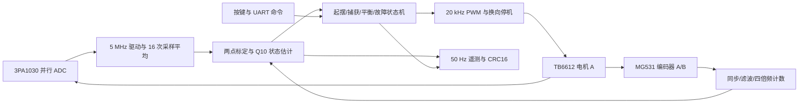

# J280 实时姿态控制系统开发项目技术文档

## 1. 范围与证据等级

本版本实现 2026 高云选题一的基础控制通路：静止下垂自动起摆、直立自平衡、轻扰恢复。硬件仅为官方 J280 开发板及倒立摆套件，主控型号 GW2A-LV55PG484C8/I7。不增加新硬件；定点位置调节与速度轨迹列入后续拓展。

工作区一级目录为 `Project` 和 `Reference`。`Project` 是 Git 仓库根，工程入口为 `Attitude_Control/Attitude_Control.gprj`；本文中的 `tools`、`tests`、`docs`、`Release` 路径均相对于该仓库根。官方输入资料位于同级 `../Reference`，校验清单中的 `Reference/...` 路径仍以外层工作区为基准，不纳入源码仓库。

赛题原文见本地选题指南 PDF 第 14 页（印刷第 12 页）。原文没有给出固定的稳定秒数、误差角度或恢复时间。本项目仿真使用 ±2° 等内部量化标准；现场建议指标见本地用户手册，均不冒充官方指标。

证据分为：资料核验、RTL 自检、指定模型的闭环仿真、EDA 时序与构建、实物测量。本版本前四类已具备验证路径；实物测量待完成。生成 `.fs` 不表示赛题功能已经实测达标。

## 2. 官方工程当前逻辑与改动理由

官方 Interface_test 通过 ADC 累加平均读取电位器，两个编码器做四倍频计数，按键选择电机方向，固定占空比驱动电机，按键触发串口发送。它用于接口连通性演示，不包含自动起摆、平衡反馈和稳定性验收。

新工程保持板级连接依据，重建有明确时序和单位的闭环。避免只在固定占空比演示上叠加 PID：角度、角速度、摆臂位移与速度必须在同一控制节拍更新，算法还需处理捕获切换、输出限幅和异常停机。未改变 Reference 原件；校验清单见 `docs/reference_manifest.json`。

## 3. 架构与调用链



| 模块 | 职责 |
| --- | --- |
| `reset_sync` | 异步复位断言、两拍同步释放 |
| `key_debounce` | 按下/松开消抖、单次按下脉冲 |
| `adc_sampler` | 5 MHz 外发时钟、固定相位整总线锁存、启动丢弃、16 样本和 |
| `quadrature_encoder` | 两级同步、AB 状态滤波、四倍频计数、非法转换报警 |
| `calibration_divider` | 标定时运行的 32 拍恢复除法器 |
| `state_estimator` | 标定、角度换算、摆臂换算、速度差分/IIR、采样异常判断 |
| `attitude_controller` | 起摆能量门控、直立捕获、全状态反馈、限幅和故障锁存 |
| `motor_pwm` | 周期边界更新、换向空白、停止高阻 |
| `uart_rx_byte` / `uart_tx_byte` | 115200 bps、8N1、握手与停止位错误检查 |
| `telemetry` | 一致快照、24 字节帧、CRC16 |
| `top` | 板级连接、按键/命令映射、点动、停止门、遥测节拍 |

## 4. 引脚与资料依据

下表是封装球位，不是排针脚号。CST 对全部 29 个顶层位端口显式约束；开发脚本同时检查重复球位、遗漏端口和电压。

| 接口 | 端口与球位 | 电平 |
| --- | --- | --- |
| 时钟 / 复位 | `clk_50m=M19`，`rst_n=AB3` | 3.3 V |
| SW1～SW4 | `key_sw[0..3]=T18,R18,U20,T20` | 1.5 V，低有效 |
| UART | FPGA TX `K20`，RX `L20` | 3.3 V |
| ADC 控制 | CLK `G18`，OE `H20`，OTR 输入 `F18` | 3.3 V |
| ADC D9～D0 | `E19,G17,G19,H19,H18,D19,J19,J20,M21,L21` | 3.3 V |
| 编码器 A | A 相 `Y20`，B 相 `AA20` | 3.3 V |
| 电机 A | IN1 `Y17`，IN2 `Y19`，PWM `Y18` | 3.3 V |
| 电机 B | IN1 `AA17`，IN2 `V15`，PWM `V14` | 3.3 V，固定停止 |

核验依据：J280 用户手册 PDF 第 14、17、25～27 页、核心板 `coreboard_20230817.pdf` 和底板 `Balance_Ctrl_20260618.pdf`。具体差异处理：

- 激活参考 CST `fo_rip_top.cst` 的 B 路 IN1/IN2 与电路图不同；采用手册电路与底板图的 AA17/V15，另一份 `AD_test.cst` 也与之相符。
- 用户手册 UART 描述列与 CH340 实际连接方向不同；按 CH340 RXD 接 FPGA TX K20、TXD 接 FPGA RX L20 使用。
- AB3 复位来自 BANK5 的 3.3 V 电路，沿用官方 CST 的 LVCMOS33，不采用冲突表格中的 1.5 V 栏。
- ADC STBY 直接接 AGND，TB6612 STBY 接 3.3 V，均不添加 FPGA 端口。ADC OTR 是输入，不是输出。
- T20 默认保留为 SSPI 专用脚。`build.tcl` 设置 `-use_sspi_as_gpio 1`，GUI 使用时须检查该复用选项。

## 5. 采样与时序

系统使用 50 MHz 单一内部时钟，模块通过时钟使能更新状态。ADC 外发时钟 5 MHz；phase=0 拉高，phase=5 拉低，phase=4 整体锁存数据与 OTR。系统内部捕获相位距离驱动寄存器翻转为 80 ns。实际 ADC 球位时钟边沿包含 C2Q、IO 和 PCB 延时，需要实测。

3PA1030 数据手册第 8 页给出 25 ns **典型**输出延时、4 周期典型流水线延迟；25 ns 没有最大值保证。启动丢弃 63 个 ADC 周期。每 3125 个系统周期取一次已经锁存的码值，16 次形成一个 1 ms 样本。

`sample_q4` 是 16 个 10 位整数的和，相当于原始 ADC 平均值带 4 个小数位。它不是新增的 14 位 ADC，也不能保证静止噪声下有额外有效分辨率。

SDC 使用 50 MHz 主时钟、5 MHz 外发派生时钟，ADC 输入最大延时预算 45 ns、最小 0 ns。该预算包含外发时钟延时、典型 tOD 与线路，**是板级假设，待波形核验**。只对 ADC 输入至 `captured/over_range` 的相位使能路径设置 setup=4、hold=9、`-end`：实际检查源 0 ns 到目的 80 ns 的建立，以及下一源 200 ns 到当前目的 80 ns 的保持。其余寄存器逻辑仍按每拍 20 ns 检查。

异步按键、UART、编码器只通过同步前级使用；外部复位允许异步断言。SW3 另有直接停止门和独立两级同步，raw 按下立即撤销电机驱动，状态机随后进入 IDLE，松开不自动重启。内部故障到输出路径仍参与 STA。

PWM 比例先约分：2500/1000=5/2，避免原始组合除法产生长路径。余弦索引的固定除法改为倒数乘法加一次校正并流水化，仍精确等于 `floor(abs(theta)*32/3217)`。两者属于根因级时序优化，不依赖放宽内部时钟约束。

## 6. 标定、单位与状态估计

电位器 WDD35D4 的电气行程约 345°±2°，机械可连续旋转 360°。底板模拟电路推导为 `ADC电压≈1+传感器电压/5`，不能直接把 1024 码视为完整 345°。

停机时先记录下垂 `down_q4`，再记录直立 `up_q4`，两位置必须处于同一连续电气区间。标定除法计算：

```text
span = abs(up_q4 - down_q4)
scale = floor(3294199 / span)       // pi * 2^20 / span
polarity = -1 if up_q4 > down_q4 else +1
theta_q10 = ((sample_q4-up_q4) * scale * polarity * THETA_SIGN) >>> 10
```

角度映射到 [-π,π]，整数 π=3217、2π=6434。拒绝跨度小于 32 原始码、过大跨度和近 ADC 电源轨的直立点。两点标定不能判断安装坐标的物理正方向，`THETA_SIGN` 必须现场核验；它也不能消除电气盲区。

| 变量 | 格式与含义 |
| --- | --- |
| ADC | 10 位无符号原始码；内部和为 Q4 码值 |
| theta / omega | signed16 Q10 rad / rad/s，直立为零 |
| arm / arm_speed | signed16 Q10 rad / rad/s，直立标定时的转臂位置为零 |
| position | signed32 四倍频累计计数 |
| command | signed16 PWM 千分比，-1000～+1000 |
| K | signed32，Q10 千分比每 rad 或 rad/s |

MG531 手册给出 13 线和 1:20 减速比，推导四倍频计数为 1040/输出轴圈；这不是单圈实测值。换算 `ENC_COEFF=floor(2*pi*2^20/COUNTS_PER_REV)=6334`，摆臂 Q10=`counts*6334 >>>10`。A 领先 B 的 `00→10→11→01→00` 为正计数。

速度采用 1 ms 差分和 IIR：`filtered += (new-filtered) >>>3`，内部 32 位保留余数。第一帧和停机时清零微分，避免启动冲击。运行中 ADC 连续帧跳变大于 32 原始码或异常角度范围会锁存 sensor_fault；坏样本保留前一可信角度并清速度。显著盲区跳变可能触发该保护，但不能把未触发跳变等同于可靠盲区检测。

新标定取消在途状态估计，避免旧流水线结果覆盖新零点和速度初始化。复位或重新下垂标定可清除估算器故障。

## 7. 控制算法

### 7.1 状态机和保护

IDLE=0、SWING=1、BALANCE=2、FAULT=3。点动由顶层处理，遥测显示 JOG=4。上电 IDLE、电机高阻；只有标定成功且传感器无故障才能启动。

默认保护：采样丢失 2 ms、摆臂绝对位置超过 6 rad、转臂速度超过 20 rad/s、摆杆速度超过 30 rad/s、起摆超过 15 s、平衡倾角超过 40°、ADC OTR 或编码器非法转换。保护门限是工程参数，不是官方机械安全额定值，应根据套件真实运动范围收紧。

故障位：0x01 传感器/接口异常；0x02 标定失效；0x04 采样看门狗；0x08 位移/速度保护；0x10 起摆超时；0x20 平衡跌落。停止/清除只能清控制器故障，持续传感器异常仍拒绝启动。

### 7.2 自动起摆

直立为 θ=0，归一化能量缺额 `d=1-cos(theta)-omega²/196.2`。定点近似：`d_q10=1024-cos_q10-((omega_q10²*167)>>>25)`，动能乘积显式使用 64 位，防止高速度时溢出。

余弦使用 33 点表。按速度和余弦的符号位异或选择泵方向；d<0 时反向抽取能量。输出：

```text
command = (+667 or -667) - ((arm_speed*25)>>>10) - ((arm*42)>>>10)
command = limit(command, -800, +800)
```

最初 40 ms 使用 +667 千分比打破完全下垂静止点的对称性。|theta|<268 Q10（约15°）、|omega|<3584 Q10（3.5 rad/s）时捕获进入平衡。这些参数来自待辨识模型验证，应经过实物方向与起摆参数调试。

### 7.3 平衡与轻扰恢复

状态 `x=[theta,omega,arm-capture_arm,arm_speed]`。捕获时锁存摆臂位置，基础版本维持捕获附近，不强拉回上电原点。输出 `command=-(sum(K_i*x_i)>>>20)`，限幅 ±1000。

默认 Q10 增益 `[2362613,299007,-109597,-118252]`。由 1 ms ZOH 离散 LQR 推导，Q=diag(60,4,1,0.2)、R=0.5；浮点电压增益约 `[27.68687,3.50399,-1.28434,-1.38577]`。捕获后的位移刚度按每 128 ms 的 25%、50%、75%、100% 递增，速度阻尼始终全量。乘积、索引、求和与输出分级寄存；每个样本计算在十余拍以内完成，远短于 1 ms。

模型假设：摆臂长0.152 m、摆杆长0.150 m、两者质量0.090 kg、均匀杆惯量、阻尼0.001/0.0001 N·m·s/rad。电机12 V、6.6 kgf·cm、549 rpm 来自本地介绍手册标称；由此推导线性力矩/反电势模型，不包含电感、齿隙、限流、温升。实测参数应替换假设并重算增益。

## 8. 电机与用户接口

20 kHz PWM，非零幅值与方向在周期边界采纳，零命令在下一系统拍清除方向。enable/复位直接撤销驱动，顶层 SW3 raw 门立即关闭。换向至少等待 DEAD_CYCLES=100 拍并重新对齐周期，默认实际空白可能约50 μs。正向 IN10、反向 IN01；停止 IN00、PWM1，为 TB6612 数据手册第4页定义的高阻，不能把 PWM0 误当高阻。B 路恒定停止。

| 操作 | 按键 | UART ASCII | 条件 |
| --- | --- | --- | --- |
| 下垂标定 | SW1 | D | 停机，记录当前下垂点 |
| 直立标定 | SW4 | U | 已有下垂点，停机 |
| 自动运行 | SW2 | G | 标定、方向核验与运动范围检查后，从下垂启动 |
| 停止 | SW3 | S | 任意状态；SW3有立即停止门 |
| 清控制故障 | 无 | R | 非运行状态；不替代传感器重新标定 |
| 正/反方向点动 | 无 | F / B | 标定后 IDLE，10%占空比，最多150 ms，不能连续续期 |

点动只用于核验方向，G 在点动期间拒收，停止、标定、过量程或位移/速度异常中断点动。按下标定键若原先运行，第一次用于停止；停稳后再按一次标定。

UART 115200、8N1，实际整数分频434，对应约115207 bps。控制命令是独立 ASCII 字节，不带换行要求；遥测是二进制帧，普通串口终端不能直接作为角度显示器。

24 字节帧：AA 55 01 18；序号2字节；ADC2字节；theta、omega、arm、arm_speed、command各signed16；state、calibrated标志、fault、保留0各1字节；CRC2字节。多字节小端，CRC16/CCITT-FALSE初值FFFF、多项式1021，覆盖前22字节。约50 Hz；忙时丢弃新触发，不覆盖当前快照。`telemetry_monitor.py` 做同步、CRC和CSV记录。

## 9. 验证与可复现结果

### v0.2.0 图形上位机

`tools/host_monitor.py → host/app.py` 是入口与界面；`host/transport.py` 的独立线程拥有串口与命令队列；`host/core.py` 负责同步、CRC、小端/Q10 解码、序号诊断、实验统计、记录与回放。命令和 v1 帧沿用现有 FPGA 定义。

连接不发送启动命令；演示/回放不能控制设备。运动操作要求接收线程时间戳在 1 秒以内、标定、待机、明确无控制器故障及方向核验；界面积压不刷新旧帧时间，旧连接信号不进入新会话。S 不依赖最新遥测；派发锁与命令代次取消队列内及已出队但尚未写入的旧命令，断开同样取消旧派发。已开始的串口写入不可撤回，停止请求可能等待现有 250 ms 写超时及线程调度。协议无 ACK，仅记录写入，执行结果由状态反馈确认。默认关闭尝试 S，通信失败仍须 SW3。

独立会话包含 CSV（单位值、原始 Q10、主机时间、来源、序号诊断）、校验后原始帧、事件、现场元数据与摘要。后台每秒刷新，正常关闭落盘。缺帧、重启、接收间隔超过 100 ms、故障及未标定中断连续指标。起摆以 800‰、平衡以 1000‰统计限幅；恢复从人工扰动结束标记起算，默认 ±2°/0.5 s 是内部判据。

停机时 RTL 将速度估计清零；当前没有上报原始编码器计数、实际使能/输出、电流或温度。50 Hz 遥测与主机接收时间不能替代 1 kHz 控制时间戳，序号只能检查已发送快照连续性。

PC 已准备 v2 TLV 解析（基础字段加可选设备时间、计数、目标值、观测与诊断），详见 [PROTOCOL](host/PROTOCOL.md)。当前 `telemetry.v` 仍只发送 v1，缺失字段不补零；FPGA 扩展发送与在线参数写入未实现。新增 55 项上位机离线验收通过，全部 65 项 Python 回归通过，证据见 `docs/host_validation.json`；物理串口仍待验。

统一命令：`python tools/run_tests.py`。测试缺少仿真器或断言失败会非零退出。详尽结果见 `docs/验证记录.md` 与 `docs/build_validation.json`。

RTL 自检覆盖接口、平均/标定、重标定竞态、能量四象限、精确余弦索引、动能溢出、捕获/保护、停止优先、命令映射。真实闭环测试将实际估算器、控制器和电机PWM输出接入非线性模型，包含16次瞬时10位ADC量化、1040CPR位置量化、换向空白及外力矩。

指定安装相位210°、THETA_SIGN=-1和假设机械模型：0.769 s一次捕获，末两秒最大绝对角0.687°；2.000～2.050 s施加0.01 N·m模型扰动，峰值2.790°，结束后0.353 s恢复并连续500 ms维持±2°。没有触发盲区、故障或软限位。Python算法模型独立给出类似结果，并包含不利安装跨盲区停机负例。

闭环测试将时间按比例压缩、保持控制/PWM/模型的相对节拍；没有模拟真实线路传播、机械间隙、电流限制和热效应，也没有把所有物理顶层接口纳入该动力学闭环。顶层引脚逻辑另有集成自检。因此证据应称“指定模型上的真实RTL闭环”，不能称“实物HIL”或“赛题全达标”。

## 10. 后续改动边界

基础现场标定与验收通过后，才新增目标位置接口、受限目标斜坡和轨迹发生器。后续创新继续限定现有 J280 硬件；状态观测、自适应辨识及约束控制的路线见 README。现场操作、测量步骤及原始记录维护在本地 `用户手册.md`；工程复现、当前缺口与开发待办维护在本地交接文档，两者均不提交 Git。
