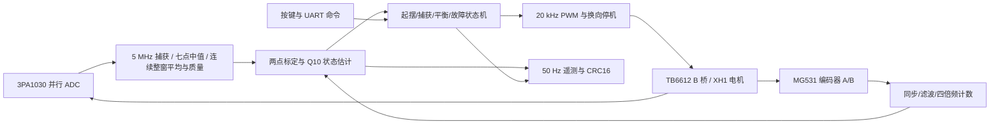

# J280 实时姿态控制系统开发项目技术文档

## 当前采样与故障语义（2026-10-06）

project-v0.3.0 / host-v0.7.0 将 ADC 诊断与控制测量解耦：median7 全窗原均值继续上报；新增 control_q4 经突变确认后送入标定和估计器，TLV34 保存该输入。水平盲区不锁存 0x01；短不可用测量重新建立速度基线，16 个可信样本后允许新 H。真实持续异常、断流、运动越限及跌落保持保护。详见 [算法与门限](docs/ADC去尖峰与水平盲区.md)及 [协议](host/PROTOCOL.md)。

H 四项 Q10 增益 `[904758,77909,-34213,-61768]` 与有界积分保持，普通有效样本的状态映射、速度 IIR 和控制公式不变。目标是末段摆臂峰峰 ≤5°、进一步 ≤2°；已有日志不满足，不能用去尖峰或标称模型结果代替实物收敛。最新聚合数据见 [H 稳定目标](docs/H稳定目标与日志基线.md)，本版测试／EDA／实物证据分列于 [验证清单](docs/project-v0.3.0_validation.json)。

下列带旧版号的分析、协议长度和故障规则属于历史，不覆盖本节。

本版冻结源码通过453项Python测试、31个RTL测试和真实UART/主机数字链路核对；源码与EXE启动检查通过。Gowin在50MHz约束下setup/hold违例均为0，Fmax为50.072MHz，后续RTL改动须重新核对完整时序。测试与构建均未代替实物小摆幅验收。

## 历史：host-v0.6.9 接管提示与逐周期核验

host-v0.6.9 增加显眼的H接管步骤和状态提示，以新鲜遥测区分等待接管与已观测到H运行；串口写入或旧的“启动已接纳”不作为本次成功。423项Python测试及EXE离线启动检查通过。FPGA继续使用project-v0.2.9，控制参数和保护未修改。周期摆动、长期小幅平衡、轻推恢复和自动起摆仍未验收。

1kHz实测4096行与RTL逐整数一致；一次后续H保持待机并被拒收，不能归因于接管输出不足。分析工具从原始CRC包重建，仅使用明确版本的参数；保留传输、连续性、数字一致性和实物效果的区别。见[详细分析](docs/H逐周期实测与接管确认.md)。

## 1. 范围与证据等级

project-v0.2.9 / host-v0.6.8 已接通H连续控制记录：保存最近4096次真实提交，停止后通过T导出，原始Q10/Q24、ADC、编码器和命令单独保存。H增益仍为v0.2.8的S120，测量、G和保护未改。当前周期摆动尚未解决；记录功能不能替代实物平衡验收。 372项Python测试通过；真实顶层UART、完整4096行导出、坏包/断连、后台写盘与UI专项通过。修复立即重启H误冻结和冻结原因误判，冻结v0.2.8控制器逐拍对照通过。Gowin Fmax 52.140MHz，setup/hold为0/0，BSRAM为65/140。全部既有RTL测试在本轮已通过，记录边界修复后的相关测试另行复验；不把缩时接口仿真当作实物稳定性证明。 详细字段和仲裁见[连续记录协议](docs/H连续控制记录协议草案.md)，证据见[本版验证](docs/project-v0.2.9_validation.json)。

本版本实现 2026 高云选题一的基础控制通路：静止下垂自动起摆、直立自平衡、轻扰恢复。硬件仅为官方 J280 开发板及倒立摆套件，主控型号 GW2A-LV55PG484C8/I7。不增加新硬件；定点位置调节与速度轨迹列入后续拓展。

上一控制参数版本为 **project-v0.2.8 H对照候选 / host-v0.6.7**。v0.2.7已有约29.36秒松手保持证据，周期摆臂幅度较v0.2.6缩小约33%，仍未停稳。H四项Q10为`[904758,77909,-34213,-61768]`，仅速度项幅值比v0.2.7再提高约9.09%；积分Q24步长仍为`237*(arm-capture)`，限幅±100‰、限速约20‰/s，含原门禁、抗饱和和停止清零。G、ADC、估计器、方向及全部保护保持。帧长208、ID`0x00020008`；上位机分别识别06/Qi1、07/S110、08/S120，参数为已知静态定义，未知版本不推定。依据与模型代价见[第二次速度反馈对照](docs/H速度反馈第二次对照.md)，原定点规则见[居中控制说明](docs/H居中控制与零点敏感性.md)。小幅长期平衡、轻推恢复和自动起摆尚未验收。

前版 **project-v0.2.5 / host-v0.6.4** 新增H专用低带宽R32反馈，Q10为`[853198,72979,-14826,-45257]`。其现场两次H分别在2.02s、9.18s触发位置限位，后继才有ADC故障；完整刚度520帧与反馈公式逐整数一致。降低快速输出放大并未消除位置漂移，见[前版设计](docs/H直立平衡振荡分析.md)及本轮说明。

低带宽参数降低速度变化的输出放大，也减弱位置刚度：名义1°角零偏可能对应约57.5°摆臂静态偏移。独立模型包含均值与IIR延迟、量化、额外执行响应，并另核对零命令高阻时移除电气阻尼；不能将未辨识的共振压力模型或平均驱动模型视为实际机械系统。原v0.2.4采样/方向变更见[前版说明](docs/方向限位与连续采样修复.md)。

前版 **project-v0.2.2 / host-v0.6.2** 增加转换级诊断旁路：上一窗口参考、全中值范围与总和、贡献值范围、离群数量及最长长度、ADC转换来源的数字驱动标签，首次传感器故障保留整组统计和设备时刻。该版采样、估计、驱动、方向参数与保护行为保持上一版；新统计不参与控制。其190字节v2的布局见[协议](host/PROTOCOL.md)，定义及物理边界见[ADC转换级诊断](docs/ADC转换级诊断.md)。

前版 **project-v0.2.1 / host-v0.6.1**：ADC 连续原码经三点中值后形成 16 点平均，原码跨度警示与滤后质量判据分开；停机恢复连续可信采样后，显式 R 可清除传感器锁存并保留标定。沿用全状态速度估计、16 样本成熟度和 H 直立接管，以 **106 字节 v2** 遥测上报设备身份、原码、滤后均值、窗口、端点、门控后命令、首次故障及其采样证据。上位机曲线独立以 10 Hz 绘制，接收与逐帧日志仍约 50 Hz。控制增益与 ADC 外部采样相位未改；增益仍为名义模型值，不能称为官方 PID 的复刻。用户确认官方位流同一硬件可平衡，是独立的实物对照，不代表本版已验收。

前版验证见 [project-v0.2.1 验证记录](docs/project-v0.2.1_validation.json)，故障依据与验收次序见 [静止采样故障与绘图积压修复](docs/静止采样故障与绘图积压修复.md)，字段与命令约定见 [协议](host/PROTOCOL.md)。[ADC 重构与官方 PID 对照](docs/ADC重构与官方PID对照.md)保留 project-v0.2.0 的研究与实现记录；下文旧版验证均明确归属，不替代当前版本证据。

工作区一级目录为 `Project` 和 `Reference`。`Project` 是 Git 仓库根，工程入口为 `Attitude_Control/Attitude_Control.gprj`；本文中的 `tools`、`tests`、`docs`、`Release` 路径均相对于该仓库根。官方输入资料位于同级 `../Reference`，校验清单中的 `Reference/...` 路径仍以外层工作区为基准，不纳入源码仓库。

赛题原文见本地选题指南 PDF 第 14 页（印刷第 12 页）。原文没有给出固定的稳定秒数、误差角度或恢复时间。本项目仿真使用 ±2° 等内部量化标准；现场建议指标见本地用户手册，均不冒充官方指标。

证据分为：资料核验、RTL 自检、指定模型的闭环仿真、EDA 时序与构建、实物测量。本版本前四类已具备验证路径；实物测量待完成。生成 `.fs` 不表示赛题功能已经实测达标。

## 2. 官方工程当前逻辑与改动理由

官方 Interface_test 通过 ADC 累加平均读取电位器，两个编码器做四倍频计数，按键选择电机方向，固定占空比驱动电机，按键触发串口发送。它用于接口连通性演示，不包含自动起摆、平衡反馈和稳定性验收。

官方 `Interface_test/src/top.v` 将两路 `duty_out` 固定为 60；`motor_ctrl.v` 的周期为 5400 拍、比较值为 `60×20=1200`，按 50 MHz 推得约 9.259 kHz、22.22% 占空比。编码器只用于显示/串口，没有进入 PWM 调节，因此上手手册中的正反“匀速”不能解释为闭环恒速。当前电机测试沿用项目的 20 kHz PWM，15%/22% 是固定占空比档位，不承诺恒速或固定转角。

套件只有一个用于驱动摆臂的 MG531 主动电机；摆杆端的 WDD35D4 是电位器式角位移传感器，摆杆运动依靠机构耦合。依据为介绍手册 PDF 第 5 页系统框图、第 14～15 页传感器说明和上手手册 PDF 第 5 页装配说明。上手手册 PDF 第 14 页允许同一电机接 XH1 或 XH2 做接口测试，第 15 页的 PID 运行接法指定 XH1；这不表示摆杆还有一台独立电机。本工程继续只驱动 B 桥/XH1，A 桥/XH2 高阻。

新工程保持板级连接依据，重建有明确时序和单位的闭环。避免只在固定占空比演示上叠加 PID：角度、角速度、摆臂位移与速度必须在同一控制节拍更新，算法还需处理捕获切换、输出限幅和异常停机。未改变 Reference 原件；校验清单见 `docs/reference_manifest.json`。

## 3. 架构与调用链



| 模块 | 职责 |
| --- | --- |
| `reset_sync` | 异步复位断言、两拍同步释放 |
| `key_debounce` | 按下/松开消抖、单次按下脉冲 |
| `adc_sampler` | 5 MHz 整总线捕获、七点中值、连续整窗均值、原码证据与分块质量 |
| `quadrature_encoder` | 两级同步、AB 状态滤波、四倍频计数、非法转换报警 |
| `calibration_divider` | 标定时运行的 32 拍恢复除法器 |
| `state_estimator` | 标定、状态换算与连续估速、测量成熟度、异常原因锁存与受限 R 恢复 |
| `attitude_controller` | 起摆能量门控、直立捕获、全状态反馈、限幅和故障锁存 |
| `motor_pwm` | 周期边界更新、换向空白、停止高阻 |
| `motor_test` | 独立定 PWM 测试、运行时限、启动零计数与相对位移限制、结束原因 |
| `uart_rx_byte` / `uart_tx_byte` | 115200 bps、8N1、握手与停止位错误检查 |
| `telemetry` | 一致快照、208 字节 v2（保留 24 字节 v1 构建）、CRC16 |
| `top` | 板级连接、按键/命令映射、点动/定 PWM 测试仲裁、停止门、遥测节拍 |

## 4. 引脚与资料依据

下表是封装球位，不是排针脚号。CST 对全部 29 个顶层位端口显式约束；开发脚本同时检查重复球位、遗漏端口和电压。

| 接口 | 端口与球位 | 电平 |
| --- | --- | --- |
| 时钟 / 复位 | `clk_50m=M19`，`rst_n=AB3` | 3.3 V |
| SW1～SW4 | `key_sw[0..3]=T18,R18,U20,T20` | 1.5 V，低有效 |
| UART | FPGA TX `K20`，RX `L20` | 3.3 V |
| ADC 控制 | CLK `G18`，OE `H20`，OTR 输入 `F18` | 3.3 V |
| ADC D9～D0 | `E19,G17,G19,H19,H18,D19,J19,J20,M21,L21` | 3.3 V |
| XH1 编码器 1 | A 相 `Y20`，B 相 `AA20` | 3.3 V |
| TB6612 A 桥 / XH2 | IN1 `Y17`，IN2 `Y19`，PWM `Y18` | 3.3 V，固定高阻停止 |
| TB6612 B 桥 / XH1 | IN1 `AA17`，IN2 `V15`，PWM `V14` | 3.3 V，当前闭环驱动 |

核验依据：J280 用户手册 PDF 第 14、17、25～27 页、核心板 `coreboard_20230817.pdf` 和底板 `Balance_Ctrl_20260618.pdf`。具体差异处理：

- **XH1 与芯片 A/B 名称不能混用。** `Balance_Ctrl_20260618.pdf` 第 1 页及用户手册 PDF 第 26～27 页电路明确：U4 `BO1`（11/12）→`O1`→XH1-1，`BO2`（7/8）→`O2`→XH1-6；`AO1`（1/2）→`O3`→XH2-6，`AO2`（5/6）→`O4`→XH2-1。底板 PDF 第 2 页 PCB 连通分组再次确认这些网络。用户手册表格称 O1/O2 为“通道 A”，与芯片桥名不一致；采用电路及 PCB 连通证据。上手使用手册 PDF 第 15 页（印刷第 12 页）3.4 Step1 指定电机接 XH1。project-v0.1.3 将 PWM 实例从 AN/PWMA 移至 BN/PWMB，与 enc1 配对，A 桥保持 IN00/PWM1。CST 物理球位不换名，不同时驱动两路。该修复能解释获准启动后电机无输出，但不单独解释待机拒收。
- 激活参考 CST `fo_rip_top.cst` 的 B 路 IN1/IN2 与电路图不同；采用手册电路与底板图的 AA17/V15，另一份 `AD_test.cst` 也与之相符。
- 用户手册 UART 描述列与 CH340 实际连接方向不同；按 CH340 RXD 接 FPGA TX K20、TXD 接 FPGA RX L20 使用。
- AB3 复位来自 BANK5 的 3.3 V 电路，沿用官方 CST 的 LVCMOS33，不采用冲突表格中的 1.5 V 栏。
- ADC STBY 直接接 AGND，TB6612 STBY 接 3.3 V，均不添加 FPGA 端口。ADC OTR 是输入，不是输出。
- T20 默认保留为 SSPI 专用脚。`build.tcl` 设置 `-use_sspi_as_gpio 1`，GUI 使用时须检查该复用选项。

## 5. 采样与时序

系统使用 50 MHz 单一内部时钟，模块通过时钟使能更新状态。ADC 外发时钟 5 MHz；phase=0 拉高，phase=5 拉低，phase=4 整体锁存数据与 OTR。系统内部捕获相位距离驱动寄存器翻转为 80 ns。实际 ADC 球位时钟边沿包含 C2Q、IO 和 PCB 延时，需要实测。

3PA1030 数据手册第 8 页给出25ns典型输出延时、4周期典型流水线延迟；25ns没有最大值保证。启动丢弃63个ADC周期。七点中值仍采用七轮寄存奇偶比较交换，在相邻200ns转换间完成；输入捕获及来源标签相位不变。

从v0.2.4起，控制使用完整1ms窗口中的所有连续中值输出，默认5000个。独立控制求和与计数经过顺序除法，精确得到`floor((16*sum+floor(count/2))/count)`，半数向上舍入。诊断计数/总和夹断不参与控制。窗口闭合后固定流水延迟发布，均值、原始极值、质量和统计必须同窗；流水期间继续采集下一窗口。诊断事件随闭窗标记一起延后，使新窗最早转换也能使用紧邻前窗的控制均值基准，避免错用前前窗。

`sample_q4`是控制均值的Q4表示，不是新增14位ADC，也不保证静止噪声下有额外有效分辨率。相较原来每62.5μs抽一次、16点求和，连续整窗平均去掉稀疏取点，默认群延迟约增加31μs；单级boxcar仍不是理想抗混叠滤波器，不宣称消除所有噪声。

默认质量块为连续40个中值输出（8μs），整除5000。块均值窗跨度及相邻块步进分别检查32code，跨窗保留前一完整块。块内方差检查使用完整整数`B*sum(x²)-sum(x)² > B²*256`，B=40，对应RMS>16code；保留等号边界。全流均值不能使持续高低混码伪装健康，慢变/持久异常仍由块均值或相邻1ms估计器检查。原始OTR及0/1023轨端继续逐转换旁路保留，原码跨度>32仅作警示。质量位6新增块方差超限，位2/3改为块均值跨度/步进；历史版本仍按当时中值流判据解释。

七点中值及来源统计不变：输入按旧到新稳定排序，相等不交换，取索引3；全相等时标签来自中心转换。标签仍按ADC四周期流水对齐，数字驱动观察位于ADC下降沿后下一50MHz拍，有固定20ns偏移。TLV26/27中滤后极值、步进、离群和总和/数量仍描述七点中值输出，不是均值块；`contribution_min/max`新版仅保留16个诊断抽样点范围。`reference_q4`为上一完整连续控制均值，存在不代表健康；最长离群计数不是模拟毛刺宽度。未饱和的全流总和/数量可核对同窗控制均值，差异仅为Q4舍入。

现场首故障窗仅5/5000个中值离群、控制均值稳定但中值跨度33码，支持短扰动误拒的设计缺口；不能据汇总统计还原模拟波形或唯一判定干扰来源。原始轨端路径、持续偏差、滤波效果与控制方向均须实板验证。

SDC使用50MHz主时钟、5MHz派生时钟，以3PA1030 Figure22对应的**下降沿**为外部数据更新参考。最大输入延迟45ns、最小0ns仍为板级预算，25ns tOD只是器件典型值。对ADC输入至captured/over_range使用`-clock_fall`、setup=9/end、hold=9/end：源fall100ns到目的280ns建立(180ns)，对应源fall100ns与前次目的80ns保持(等价捕获后20ns的下一数据发射)。Gowin例外报告确认实际命中；这些预算仍需实板时序裕量核验。其余内部寄存器按20ns周期检查。旧上升沿setup=4解释已废止。

异步按键、UART、编码器只通过同步前级使用；外部复位允许异步断言。SW3 另有直接停止门和独立两级同步，raw 按下立即撤销电机驱动，状态机随后进入 IDLE，松开不自动重启。内部故障到输出路径仍参与 STA。

PWM 比例先约分：2500/1000=5/2，避免原始组合除法产生长路径。余弦索引的固定除法改为倒数乘法加一次校正并流水化，仍精确等于 `floor(abs(theta)*32/3217)`。两者属于根因级时序优化，不依赖放宽内部时钟约束。

## 6. 标定、单位与状态估计

《J280 姿态控制系统开发套件介绍手册》PDF 第 15 页给出 WDD35D4 电阻 5 kΩ、电气行程 345°±2°、机械连续 360°，并说明 0～345°对应 0～3.3 V。底板原理图第 1 页 XH3 的 1/2/3 脚分别为 AGND、VCC3V3、JDU；角位移传感器采用 3.3 V 供电，不能将电机霍尔编码器资料的电压当成角传感器电压。3PA1030 的供电为 3.3 V，但本图名义模拟输入范围为 0～2 V；供电电压与 ADC 满量程不同。

按 `Balance_Ctrl_20260618.pdf` 第 1 页实际节点推导：R12=18 kΩ、R14=2 kΩ，R14 下端接 AGND，故 U6 正输入为 `JDU/10`；R15、R16 均为 510 Ω，R16 另一端接 U9B 产生的 −1 V，闭环得到 `ADC电压≈1+JDU/5`。在该图理想元件条件下，JDU=0～3.3 V 对应 AIN≈1～1.66 V。这是**此 PDF 名义拓扑推导，与现场码值及介绍手册的对应关系尚未闭合，不能当作实板已测传递函数**。需核对实板版本、接线和信号路径，不能直接把 1024 码当成完整 345°，也不能据该公式断言实板故障。

3PA1030 数据手册 PDF 第 21 页图 23 显示 OTR 在量程上端和下端越界时均有效；原始码 0 与当前 OTR 同时出现可表示低端越界，不只代表过高电压。聚合故障 0x01 还包含接口与估计器异常，应结合诊断字节分别判断。电气行程之外的具体输出及安装相位须实物核验，不能从单一零码、跳变或 OTR 确诊盲区。

上手使用手册 PDF 第 18 页（印刷第 15 页）提供联轴器两端松开、轻微转动角位移传感器并重新紧固的机械相位调整方法。该页的 990～1040 是官方例程显示值；本地 `Interface_test/src/adc.v` 将 10 位采样左移 2 位，`top.v` 又加 135，不能把该范围当本工程原始 ADC 标定目标，也不把例程源码与未知预装位流默认视作相同版本。

停机时先记录下垂 `down_q4`，再记录直立 `up_q4`，两位置必须处于同一连续电气区间。标定除法计算：

```text
span = abs(up_q4 - down_q4)
scale = floor(3294199 / span)       // pi * 2^20 / span
polarity = -1 if up_q4 > down_q4 else +1
theta_q10 = ((sample_q4-up_q4) * scale * polarity * THETA_SIGN) >>> 10
```

角度映射到 [-π,π]，整数 π=3217、2π=6434。拒绝跨度小于 32 原始码、过大跨度和近 ADC 电源轨的直立点。两点标定不能判断安装坐标的物理正方向，`THETA_SIGN` 必须现场核验；它也不能消除电气盲区。

| 变量 | 格式与含义 |
| --- | --- |
| ADC | 10 位无符号原始码；内部和为 Q4 码值 |
| theta / omega | signed16 Q10 rad / rad/s，直立为零 |
| arm / arm_speed | signed16 Q10 rad / rad/s，直立标定时的转臂位置为零 |
| position | signed32 四倍频累计计数 |
| command | signed16 PWM 千分比，-1000～+1000 |
| K | signed32，Q10 千分比每 rad 或 rad/s |

MG531 手册给出 13 线和 1:20 减速比，推导四倍频计数为 1040/输出轴圈；这不是单圈实测值。换算 `ENC_COEFF=floor(2*pi*2^20/COUNTS_PER_REV)=6334`，摆臂 Q10=`counts*6334 >>>10`。A 领先 B 的 `00→10→11→01→00` 为正计数。

速度采用 1 ms 差分和 IIR：`filtered += (new-filtered) >>>3`，内部 32 位保留余数。当前版沿用 project-v0.2.0 开始的连续估速，在待机、运行和故障模式都更新；只在标定、坏样本或断流恢复时重建微分历史。质量合格并连续完成 16 个样本后置测量就绪，这不等于滤波完全收敛。坏窗、相邻均值步进或角度映射异常锁存 `sensor_fault`，保留最后可信角度，速度重新初始化；质量位无效时不能根据速度零断言机构静止。

新标定取消在途状态估计，避免旧流水线结果覆盖新零点和速度初始化。新鲜且质量合格的 D/U 可清除估算器锁存并更新标定；端点跨度仍单独校验，不将请求接纳当作标定成功 ACK。project-v0.2.1 新增显式 R 恢复：必须停机、当前样本新鲜且合格、连续 16 个好窗口；已经标定时还要求估计有效且测量就绪。满足条件后清传感器故障及其原因，保留 D/U 和静止状态，不自动启动。接口锁存清除另要求当前 OTR、采样超时及编码器非法转换均未出现。持续坏窗、断采或运行中不能靠 R 解除传感器保护。

**历史差异：**project-v0.2.0 直接以全部 5 MHz 原码极值跨度超过 32 码判坏，即使 16 点平均正常也会锁存；该版 R 只清控制器故障，不清传感器锁存。上述原码整窗锁停及 R 限制已被当前版的质量分层与条件恢复替代。

## 7. 控制算法

### 7.1 状态机和保护

IDLE=0、SWING=1、BALANCE=2、FAULT=3。点动由顶层处理，遥测显示 JOG=4；独立定 PWM 测试显示 MOTOR_TEST=5，测试期间控制器仍停在 IDLE。上电 IDLE、电机高阻；G/H 均要求标定成功、测量成熟、新鲜且无故障。H 另要求 `abs(theta_q10)<268`、`abs(omega_q10)<3584`，直接进入 BALANCE 并锁定当拍摆臂原点，不发起摆 kick；同拍 G/H 以 H 为准，H 不满足时不退回 SWING。

默认保护：采样丢失 2 ms、摆臂绝对位置超过 6 rad、转臂速度超过 20 rad/s、摆杆速度超过 30 rad/s、起摆超过 15 s、平衡倾角超过 40°、ADC OTR 或编码器非法转换。保护门限是工程参数，不是官方机械安全额定值，应根据套件真实运动范围收紧。

故障位：0x01 传感器/接口异常；0x02 标定失效；0x04 采样看门狗；0x08 位移/速度保护；0x10 起摆超时；0x20 平衡跌落。S 停止并清控制器故障，不清传感器锁存；R 对传感器的清除须满足上一节恢复条件。`first_fault` 保留首次聚合故障，S 不清除；停机接受 D/U 请求或收到 R 时清零，持续异常可重新锁存。它与首次传感器原因、触发窗口是不同记录，后者随传感器锁存清除而清空。

#### 历史：project-v0.1.2 启动诊断与仲裁

SW2 经低有效同步/消抖产生按下脉冲，与 UART `G` 共用 `request_start`。启动要求 IDLE、标定有效、无板级异常且不在限时点动；`S`、同步 SW3 按下及 D/U 具有停止优先级。旧固件的启动门控已经拒绝这些异常，但遥测只发送控制器故障锁存：待机板级异常尚未触发运行故障时，可出现“待机、标定完成、故障零、指令零”，无法由这四项区分拒收原因。

该历史版新增 `telemetry_fault = fault | (board_fault ? 0x01 : 0)`，其中 `board_fault = sensor_fault || input_fault || over_range`，改变上报聚合而未改变运行许可。当时 OTR 消失不代表两个锁存故障已经清除，R 也不清它们；当前版 R 条件恢复见上一节。传感器坏样本保留最后可信角度的行为仍延续，故障帧内角度不可当成新的有效测量。

新增三位 `start_result` 在启动请求时按控制器实际优先级记录：停止优先=5；非运行状态同拍 R=7；点动中=6；非 IDLE=7；未标定=2；估计器异常=3；接口锁存异常/OTR=4；其余接受=1。project-v0.1.3 将采样超时也归入结果 4，结合故障 0x04 区分。复位为 0；新的启动请求覆盖，S/R 保留；停机 D/U 且无同拍启动请求时清为 0。诊断寄存器不参与电机使能，接受仅表示当拍请求获准，后续故障仍可停止运行。

v1 偏移 21 为 `{1'b1, start_result[2:0], SW3同步按下, over_range, input_fault, sensor_fault}`。支持标记 bit7=1 与旧固件保留 0 区分；bit3 是两级同步停止状态，不能表述为 raw 门瞬时值。完整枚举和清除规则见 [PROTOCOL](host/PROTOCOL.md)。

原点动接纳分支未排除同拍 `request_start`，板上 SW2 与串口 F/B 同拍时可能同时建立起摆与点动。现增加 `!request_start`，同拍只走启动路径；已有点动仍拒绝 G。采样、驱动力、停止门、点动幅值/时限和管脚不变。

### 7.2 自动起摆

直立为 θ=0，归一化能量缺额 `d=1-cos(theta)-omega²/196.2`。定点近似：`d_q10=1024-cos_q10-((omega_q10²*167)>>>25)`，动能乘积显式使用 64 位，防止高速度时溢出。

余弦使用 33 点表。按速度和余弦的符号位异或选择泵方向；d<0 时反向抽取能量。输出：

```text
command = (+667 or -667) - ((arm_speed*25)>>>10) - ((arm*42)>>>10)
command = limit(command, -800, +800)
```

最初 40 ms 使用 +667 千分比打破完全下垂静止点的对称性。|theta|<268 Q10（约15°）、|omega|<3584 Q10（3.5 rad/s）时捕获进入平衡。这些参数来自待辨识模型验证，应经过实物方向与起摆参数调试。

### 7.3 平衡与轻扰恢复

状态 `x=[theta,omega,arm-capture_arm,arm_speed]`。捕获时锁存摆臂位置，基础版本维持捕获附近，不强拉回上电原点。输出 `command=-(sum(K_i*x_i)>>>20)`，限幅 ±1000。

G捕获后的 Q10 增益为 `[2362613,299007,-109597,-118252]`。由 1 ms ZOH 离散 LQR 推导，Q=diag(60,4,1,0.2)、R=0.5；浮点电压增益约 `[27.68687,3.50399,-1.28434,-1.38577]`。H使用本文开头的独立增益及有界积分。两条路径捕获后的位移刚度按每128ms的25%、50%、75%、100%递增，速度项始终全量；全状态反馈中单项系数的增减不能直接等同于增减机械阻尼。乘积、索引、求和与输出分级寄存；每个样本计算在十余拍以内完成，远短于1ms。

模型假设：摆臂长0.152 m、摆杆长0.150 m、两者质量0.090 kg、均匀杆惯量、阻尼0.001/0.0001 N·m·s/rad。电机12 V、6.6 kgf·cm及减速后549±15 rpm来自本地介绍手册PDF第6页；该表未说明转速对应的负载条件。模型暂把549 rpm当作空载转速，用于线性力矩/反电势关系，这是额外假设，不是已测空载参数。模型不包含静摩擦、启动死区、电感、齿隙、限流、温升；实测参数应替换假设并重算增益。

从直立附近启动时，SW2/G先进入SWING；首个有效样本若满足上述捕获范围，便转入BALANCE，流水线提交平衡输出，不保证发出40 ms起摆脉冲。U已记录杆零位和臂原点，实际扶稳且四状态接近零时指令可以为0；新固件停机仍持续估速。其余状态为0时，约1°杆偏差对应40～41‰，约5°对应200～201‰；它们是默认参数计算值，不能作为实测电机电压或克服静摩擦的证明。板上按键控制不依赖上位机连接；实物接管失败需结合状态、故障、指令和摆臂反馈区分启动拒收、保护、执行器响应及反馈方向。

## 8. 电机与用户接口

20 kHz PWM，非零幅值与方向在周期边界采纳，零命令在下一系统拍清除方向。enable/复位直接撤销驱动，顶层 SW3 raw 门立即关闭。换向至少等待 DEAD_CYCLES=100 拍并重新对齐周期，默认实际空白可能约50 μs。正向 IN10、反向 IN01；停止 IN00、PWM1，为 TB6612 数据手册第4页定义的高阻，不能把 PWM0 误当高阻。B 桥驱动 XH1，A 桥 / XH2 恒定高阻停止。

| 操作 | 按键 | UART ASCII | 条件 |
| --- | --- | --- | --- |
| 下垂标定 | SW1 | D | 停机，记录当前下垂点 |
| 直立标定 | SW4 | U | 已有下垂点，停机 |
| 自动运行 | SW2 | G | 标定、方向核验与运动范围检查后，从下垂启动 |
| 直立接管 | 无 | H | IDLE、标定有效、测量成熟且无故障，近直立低速；不发起摆 kick |
| 停止 | SW3 | S | 任意状态；SW3有立即停止门 |
| 清除故障 | 无 | R | 停机、采样新鲜合格并连续 16 个好窗口；已标定时还需估计有效/就绪，保留标定且不自启 |
| 正/反方向点动 | 无 | F / B | 标定后 IDLE，10%占空比，最多150 ms，不能连续续期 |
| 15% 正/反定 PWM 测试 | 无 | J / K | 已标定、有效成熟测量、IDLE、无故障；与 G/H/F/B 互斥 |
| 22% 正/反定 PWM 测试 | 无 | L / M | 与 15% 档相同；档位不对应已知转速 |

点动只用于核验方向，G/H 在点动期间拒收，停止、标定、过量程或速度异常中断点动。F/B不检查累计摆臂位置，最多150ms；G/H保留累计位置限位。按下标定键若原先运行，第一次用于停止；停稳后再按一次标定。

定 PWM 测试每次最多 0.5 s，原始编码器相对起点达到 ±128 count 提前结束；启动后前 0.3 s 从未检测到计数变化也结束。零变化条件只诊断启动以来完全没有编码器变化，不等于电流检测或持续堵转检测。活动期间的新测试请求不续期、不换向，G/H/F/B 不能接管；SW3/S、D/U、OTR/传感器/接口故障、2 ms 采样期限、单次相对位移及摆臂速度保护仍可停止，不检查累计摆臂位置。R 与采样恢复不自行重启。

`motor_test_status` 保留最近测试结果：0 未测试、1 运行、2 时限结束、3 相对位移上限、4 手动或标定停止、5 故障/保护终止、6 启动以来无编码器变化、7 请求拒收。它不是逐命令 ACK。首次成功测试前相对位移为 0；成功接纳时建立原始计数起点，停止后继续上报相对该点的滑行位移，拒收不建立新起点。输出命令归零不等于机构已静止，±128 count 也不能替代实测运动空间。

UART 115200、8N1，实际整数分频434，对应约115207 bps。控制命令是独立 ASCII 字节，不带换行要求；遥测是二进制帧，普通串口终端不能直接作为角度显示器。

project-v0.2.1历史发布采用 106 字节 v2，头为 `AA 55 02 6A`，前 22 字节的基础字段位置不变；TLV1～20 的位置沿用 project-v0.2.0 的 87 字节 v2，追加 TLV21～25。CRC 位于偏移 104/105，覆盖前 104 字节。多字节小端，CRC16/CCITT-FALSE 初值 FFFF、多项式 1021。约 50 Hz，115200/8N1 下每帧约 9.20 ms；忙时丢弃新触发，不覆盖当前快照。字段与快照边界以 [协议](host/PROTOCOL.md) 为准。

project-v0.2.4 默认帧头为 `AA 55 02 C7`，长 199 字节；原 TLV1～29 位置保留，追加 TLV30（`motor_test_status`，uint8，值偏移 190）与 TLV31（`motor_test_delta`，int32，小端，值偏移 193～196）。CRC 在偏移 197/198，覆盖前 197 字节；TLV19 固件 ID 为 `0x00020004`。115200/8N1 下单帧约 17.27 ms，50 Hz 理论线路占用约 86.4%；忙时仍丢弃新触发且不覆盖发送中的一致快照。

project-v0.2.8 默认帧头为 `AA 55 02 D0`，长208字节，保留原TLV1～31位置；TLV32的7字节值位于199～205，依次为积分Q8千分比（signed16）、H参考Q10（signed16）、渐入计时（uint16）、积分标志（uint8）。CRC位于206/207，当前固件ID为`0x00020008`（v0.2.6/2.7分别为`0x00020006/07`）。50Hz理论线路占用约90.3%，上传的是50Hz快照，不是全部1kHz控制更新。

兼容 v1 构建仍为 24 字节：`AA 55 01 18`，序号、ADC、五个 signed16 状态/命令，随后为 state、calibrated、聚合 fault、diagnostic_status，最后两字节 CRC 覆盖前 22 字节。project-v0.1.1 的诊断字节保留为 0，project-v0.1.2 开始按已定义布局上报。上位机及 `telemetry_monitor.py` 共用解码器，按版本、长度、CRC 同步，可同时读取旧 v1、87/106/190/199 字节及当前208字节v2；缺失扩展量不补造为实测值。

## 9. 验证与可复现结果

**project-v0.2.8 / host-v0.6.7 当前验证：**317项Python、8个相关RTL测试台、Verilog-2005顶层与H真实RTL三组30秒名义模型闭环通过；其余13个测试台本轮未重跑。Gowin Fmax52.217MHz，setup/hold0/0，Logic7597、Register5499、DSP18.5/20。源码/EXE检查和真实遥测跨层核验见[验证记录](docs/验证记录.md)。host-v0.6.6双日志慢刷新4500帧结果作为历史性能证据，当前IO/GUI关键源文件哈希相同；本轮未重跑该计时。新实物效果仍待H对照。

**project-v0.2.6 / host-v0.6.5 历史验证：**284项Python、16个相关RTL测试台及Verilog-2005顶层通过，另6个未改测试台本轮未重跑。Gowin Fmax **51.889MHz**、Setup/Hold **0/0**、Logic **7667/54720**、Register **5499/42000**、DSP **18.5/20**。208字节合成遥测90秒共4500帧，与自动原始日志和调参CSV逐行一致；无队列溢出和遥测超时，最大交付141ms、S回调78ms。真实估计器/控制器RTL的3组30秒标称模型闭环通过，未覆盖静摩擦等实物非理想因素。最终文件与源码哈希见[本版验证](docs/project-v0.2.6_validation.json)。

**project-v0.2.4 / host-v0.6.4 历史验证：**19组RTL及Verilog-2005顶层通过。新增独立生产参数判据核对22个1ms窗口、110000个中值及原码，覆盖完整均值、40点分块质量、轨端/OTR、持续交替噪声、短扰动与跨窗归属；专项同时检查欠采后重新对齐、721窗Q4舍入和全部诊断来源。17项构建输入与最终仿真源码一致，Gowin Fmax **54.471MHz**、Setup/Hold **0/0**、Logic **7140/54720**、Register **5174/42000**、DSP **17/20**。最终Python、EXE及90秒实际帧离线回放结果见[本版汇总](docs/project-v0.2.4_validation.json)与[验证记录](docs/验证记录.md)。原始现场数据不能重建5MHz转换波形，离线回放没有复现现场3.227秒的界面积压；方向修正、持续平衡及自动起摆仍待实物确认。

**project-v0.2.3 / host-v0.6.3 历史验证：**ADC 专项 `tb_adc_quality`、`tb_adc_observability`、`tb_estimator` 已通过。覆盖 ±1/2/3 转换短扰动滤除、±4 连续同向异常拒收、原始轨端和短 OTR 旁路、默认 1 ms 节拍下的跨窗与慢坡、两次贡献取样之间约 31.2 μs 平滑异常；独立七值排名判据和外部四周期 ADC 来源模型逐项核验数值、七个来源位置、相等值标签、34 字节统计、边界与饱和。独立顶层 `tb_motor_test_top` 的真实 UART、199 字节帧/CRC、B/XH1 路由、模式互斥、时限/位移/零变化/停止/故障路径已通过。最终235项Python（217项host）、18组RTL、Verilog-2005顶层及源码/EXE启动检查通过。末项顶层旧三点均值断言改为七点精确和11912后完整复验；生产RTL未因此改变，首因与完整故障快照检查保留。最终199字节离线90秒回放（300秒历史、15000点、1366宽）4500帧完整记录，CRC/缺帧/积压溢出/超时均0；交付P99 32ms、最高47ms，89次S全部入队、回调最高32ms。脚本首轮初始化失败及最终复验均保留，见[本版验证](docs/project-v0.2.3_validation.json)。S回调和合成统计不是实物停止或ADC修复效果的证明。

本版 Gowin 构建通过：50 MHz 目标，Fmax **50.926 MHz**，Setup/Hold **0/0**；Logic **6491/54720**、Register **4680/42000**、DSP **15/20**。报告时间为 2026-09-28 02:13:41，位流 SHA256 为 `4aeb3b34eca4588c9d7c4a6b4b521a8204c6aece37806260be525b9eaef50ef8`，逐源码证据见 [该版构建记录](docs/build_validation_project-v0.2.3.json)。本轮未打开物理 COM、烧录或驱动实物；七点滤波下的静止/PWM 开启质量、双向编码器响应、停止后滑行、H/G 与物理串口长时记录仍待实物验收。

**project-v0.2.2 / host-v0.6.2 历史验证：**220项Python（其中202项host）、16组RTL、Verilog-2005顶层及源码/EXE启动检查通过。Gowin Fmax **51.893 MHz**，Setup/Hold **0/0**；Logic 5264/54720、Register 3483/42000、DSP 15/20。190字节帧、1366像素宽、预填300秒/15000点的90秒离线负载测试中，发布、交付、日志均为 **4500帧**，原始帧逐一一致，积压溢出 **0**；交付延迟p99 **47.0ms**、最大 **79.0ms**，89次停止回调最大 **46.0ms**。新增统计是明确标记的模拟输入，原日志未改；原会话循环回放有一次刻意序号回退，不是缺帧。回调不代表实物电机停止延迟，测试不替代15分钟物理串口验收。全部证据及源码校验见[本版验证](docs/project-v0.2.2_validation.json)。

**project-v0.2.1 / host-v0.6.1 历史验证：**209 项 Python 测试通过，其中 191 项为 host 测试；15 组 RTL 通过。Gowin Fmax **54.191 MHz**，Setup/Hold 违例 **0/0**，Logic **3775**、Register **2059**、DSP **15/20**。Windows 程序离线启动检查通过。90 秒、4500 帧的完整显示窗口离线重放中，全部帧交付并记录，积压溢出为零；此项使用离线数据，不打开真实 COM，不替代物理串口长时验证或实物运动验收。完整日志、哈希与结果见 [本版验证记录](docs/project-v0.2.1_validation.json)及 [发布说明](Release/project-v0.2.1/README.md)。

**project-v0.2.0 / host-v0.6.0 历史验证：**200 项 Python（其中 182 项 host）、14 组 RTL 及 Verilog-2005 顶层编译通过；Gowin Fmax 50.561 MHz，Setup/Hold 0/0，Logic 3348、Register 1846、DSP 15/20。对应原 87 字节 v2 与原码极值锁停实现，不能充当后续扩展帧版本的验证。证据保留于 [project-v0.2.0 验证记录](docs/project-v0.2.0_validation.json)和 [host-v0.6.0 归档](docs/host_validation_host-v0.6.0.json)。

project-v0.1.3 / host-v0.5.0 历史验证：172 项 Python 测试通过、无跳过；9 组 RTL 为 `tb_closed_loop`、`tb_controller`、`tb_estimator`、`tb_interfaces`、`tb_top`、`tb_start_diagnostics`、`tb_start_runtime`、`tb_fault_heartbeat`、`tb_sample_freshness`，全部通过。Gowin Fmax 50.395 MHz，Setup/Hold 0/0；Logic 3052/54720、Register 1462/42000、DSP 14.5/20。该版 Windows EXE 构建与离线启动检查通过；证据见 [FPGA 记录](docs/project-v0.1.3_validation.json) 和 [host-v0.5.0 归档](docs/host_validation_host-v0.5.0.json)。这些结果不能写成实物起摆或串口长时通过。

host-v0.5.1 历史验证为 179 项 Python 通过、无跳过，源码与 EXE 构建后的离线启动检查通过，证据见 [host-v0.5.1 归档](docs/host_validation_host-v0.5.1.json)。该次 FPGA 未改动，不以新的上位机版本覆盖原 FPGA 构建证据。

### 当前上位机 host-v0.6.7 图形工具

`tools/host_monitor.py → host/app.py` 是入口与界面；`host/transport.py` 的独立线程拥有串口与命令队列；`host/core.py` 负责同步、CRC、小端/Q10 解码、序号诊断、实验统计、记录与回放。`host/serial_config.py`、`host/settings.py` 管理参数校验与持久化，`host/serial_ui.py` 提供字节终端；`host/measurement_ui.py`、`host/measurements.py` 分别承载实测操作与纯Python辨识。新固件使用v2诊断帧，保留旧v1解码并增加H直立接管命令。

主界面保留实时曲线、实验记录及串口收发。设置支持自定义波特率、常用波特率列表、5/6/7/8数据位、N/E/O/M/S校验和1/1.5/2停止位，连接期间不可修改；配置保存为输出根目录的 `host_preferences.json`。项目模式仍要求115200/8N1，其他设置不会改变FPGA，项目控制会禁用。通用模式允许文本/HEX原始字节收发，未解析的字节不构造姿态样本，断开不发送项目停止字节；项目模式只开放原始接收查看。接收缓存保留末256KiB，可导出当前缓存，不替代完整实验会话。

“设置 → 进入开发者模式”手动切换主窗口当前页面，每次启动显示主界面。主界面集中提供 D/U/G/H/S/R/F/B 及方向与运动范围核验项；SW5 继续使用板上按键，不增加串口复位。开发者模式三页为“实测与辨识”“实验指标”“扩展遥测”，只处理测量和分析。五项实测辅助在测量页，实验指标表、恢复判据与扰动结束标记在“实验指标”，后续字段在扩展页；独立人工机械报告不依赖遥测。返回主页不重建采集会话，两页顶部及 Esc 都可停止。

host-v0.6.3 起提供“定 PWM 电机测试”的 15%/22% 档位及正反按钮，显示运行/结束原因和原始相对编码器位移，停止后继续观察滑行。电脑端还要求设备自报支持 project-v0.2.3、已标定、测量有效且成熟、当前采样可信、待机无故障、遥测新鲜、停止键释放，并完成点动空间或完整方向确认；旧固件不开放 J/K/L/M。新连接清空确认并复位到 15% 档，演示和回放不能驱动设备；测试日志保留所选档位、命令和遥测结果，不能把写入成功当作电机已动作。

可选实验记录通过`AsyncSessionRecorder`在独立后台线程创建、写入、刷新及关闭；GUI提交不可变快照，队列按2048项/8MiB双预算约束。首错锁存，保存完成前不宣告成功，退出通过事件循环等尾部保存。该变化仅消除实验文件操作对GUI的直接等待，自动/可选运行日志的`OperationLog.close`仍有原来的有限等待边界。

设置可分别保留串口原始收发和开发板控制日志，默认关闭，连接中可即时修改。`OperationLog` 使用有界后台队列，以独立会话目录保存 metadata、serial/control JSONL；控制操作先派发后入日志队列，慢盘不占串口派发锁。TX 证据取自串口驱动实际返回的写入数量，短写不标完整；排队、完整写入与设备 ACK 分开，当前固件无 ACK。日志异常提示不完整，不沿用失效日志写入器；重新保存开关可重试。关闭窗口异步等待串口线程结束，处理最终 TX/S 事件后关闭日志，避免 GUI 同步等待阻塞。

连接不发送启动命令；演示/回放不能控制设备。运动操作要求接收线程时间戳在 1 秒以内、标定、待机、明确无故障且 SW3 已释放；G/H 必须完整方向/盲区/范围核验，H 还要求识别设备版本及有效、成熟的近直立低速测量。F/B 可由独立“点动前已确认运动空间，并准备按 SW3”确认或完整方向确认解锁。每次新连接清空操作确认；界面积压不刷新旧帧时间，旧连接信号不进入新会话。S 不依赖最新遥测；命令代次取消队列内及已出队但尚未写入的旧命令，断开同样取消旧派发。阻塞串口 write 在派发锁外执行，控制调用不等待 write 返回；已开始的串口写入不可撤回，停止在串口发送顺序上仍可能等待已有写超时及线程调度。协议无 ACK，仅记录写入，执行结果由状态反馈确认。默认关闭尝试 S，通信失败仍须 SW3。

host-v0.5.0 在真实 J280 项目连接且格式为 115200/8N1 时自动开启 `captures/fpga_logs/<会话>/`：`metadata.json` 记录版本基线与串口设置，`telemetry.jsonl` 逐帧保留已验证遥测和原始值，`control.jsonl` 记录命令、状态及异常。该运行日志独立于可选 `captures/logs` 和 CSV 实验，不把演示、回放或通用字节流作为 FPGA 实测。后台写入失败或队列满会显示不完整状态，排除磁盘问题后重新连接；无 ACK，不将日志中的写入当执行确认。

串口线程交付采用有界队列，GUI 按批次和时间预算消费，防止原始 RX 与遥测逐信号无限积压；容量耗尽会明确报错并结束该连接。新鲜度仍使用接收线程单调时间，窗口关闭由异步状态推进，不能以当前绘制时刻刷新旧数据。

host-v0.6.1 将曲线绘制独立为 10 Hz，使用单像素线；无新数据、曲线隐藏或冻结时不重绘。接收处理、控制许可与约 50 Hz 逐帧日志不随绘图降频，不靠扩大交付队列或丢弃记录避免卡顿。该版90秒离线重放结果见本节历史验证；旧版现场曾出现交付溢出，不能用已保存帧 CRC 正确推断接收链从未积压。

host-v0.5.1 在自动运行日志及已开启的控制日志中追加 `operator_checks` 与 `control_availability`。前者保留两项操作声明，后者保留 G/F/B 可用值和禁用原因，均只记录初始快照与变化；`device_confirmed=false` 明确不是设备确认。G 下方即时显示原因，确认项切换立即刷新。重连清空旧接收时间及确认状态；从上位机收到连接成功通知起，等待首帧最多 1 秒，超过后仍无有效帧才记超时。等待期间禁止运动，后续接收时间新鲜度门限仍为 1 秒。

独立会话包含 CSV（单位值、原始 Q10、主机时间、来源、序号诊断）、校验后原始帧、事件、现场元数据与摘要。后台每秒刷新，正常关闭落盘。缺帧、重启、接收间隔超过 100 ms、故障及未标定中断连续指标。起摆以 800‰、平衡以 1000‰统计限幅；恢复从人工扰动结束标记起算，默认 ±2°/0.5 s 是内部判据。

测量报告保留来源、参数、人工追溯信息、误差说明与原始窗口CSV哈希；JSON中下垂/直立静态ADC端点各自保留原始样本和时间范围。默认源码输出根为 `Release/captures`、EXE为同目录 `captures`。常规会话为根目录中的 `session_*`，测量独立存入 `measurements/日期时间/`，生成 `report.json`，有遥测证据时附 `samples.csv`；人工机械记录只生成报告。`--output`可改变输出根。演示及其回放始终为合成证据，串口历史回放保留原来源但不标作本次物理实测。

实测算法的适用条件如下：

| 项目 | 可得结果 | 拒绝条件与不可推出的量 |
| --- | --- | --- |
| 静态ADC | 平均整数码的均值、标准差、跨度；有效标定时的环绕角均值与噪声RMS | IDLE且零指令，可未标定；不能称新增ADC分辨率或恢复内部Q4标定寄存器 |
| 编码器计数 | v1以 `C=6588397//configured_cpr`、`N=ceil(1024A/C)` 唯一恢复相对计数；v2明确提供时优先原始计数，以独立机械转角估CPR | C<1024、映射不符、Q10饱和、端点未静止或全程异常时拒绝；机械转角初值0须现场填写，默认1040仅用于还原 |
| ADC扫描 | 码值范围、相邻跳变、近电压轨与疑似异常采样点 | 可未标定；不自动确诊盲区，不据资料345°宣布实测电气行程 |
| 自由衰减 | 下垂角 `beta=wrap(theta−180°)`；同侧峰周期Td、指数率λ、b/J≈2λ、mgd/J≈(2π/Td)²+λ² | 小角±15°、近似固定摆臂、至少4个可信同侧峰、周期变异系数≤0.15且指数R²≥0.90；不产生绝对J或b |
| 点动响应 | 指令与位移方向、遥测估计时长、停止后位移、至少40ms角度差分窗口的峰值速度 | 仅一次state=4，前后各至少3帧IDLE，标定有效且无故障；不估精密机械时间常数、力矩或电机电气参数 |

连续辨识严格拒绝缺帧、重复、序号/时间复位、接收间隔超过100ms、已知原点/标定重置及参数版本变化；原始Q10与转换字段同时存在时校验一致性。编码器核验起终点与完整历史对应，发送D/U、重连或来源切换清缓存。遥测不能保证捕获所有板上U操作，完整数据校验仍需人工确认机械参考和原点未改变。尺寸、质量、质心等必须由独立量具测量，未知字段保留空白。

自 project-v0.2.0 起速度估计在停止时仍继续，旧 project-v0.1.x 停机清零。当前固件实际发送累计编码器计数、设备毫秒计数、ADC 窗口和门控后软件命令，并锁存首次观察传感器异常时最近发布窗口；现有硬件仍无电流、温度和实际力矩测量。50 Hz 遥测不是每个 1 kHz 控制样本的完整记录，帧序号也不能检测发送器忙时主动丢弃的触发。

当前208字节v2 TLV的字段及数据有效性见 [PROTOCOL](host/PROTOCOL.md)，上位机兼容旧199/190/106/87字节v2及24字节v1。未发送的观测量/目标值不补零，在线增益写入尚未实现。旧版验证记录单独归档，不能替代新版的构建与回归证据。

host-v0.5.0 解码诊断字节，主界面显示最近启动接受/拒收、SW3 同步停止状态、OTR、接口和估计器锁存异常，并显示按钮阻塞原因。旧固件缺少支持标记时显示“未提供”，不推定全正常。最近启动结果是历史锁存，当前标志是当前快照，两者不能混为当前条件或逐命令 ACK。日志元数据中的项目版本仍是兼容基线，不是设备自动版本识别。

project-v0.1.3 顶层增加全状态 2 ms 有效采样看门狗，超时向遥测 fault 聚合 0x04，禁止启动/点动并拒绝用旧 ADC 执行 D/U；控制器原看门狗及其门限保留。遥测由独立时钟计数统一每 20 ms 触发状态心跳，ADC 与四状态在估计完成时一起缓存，保证一致快照：采样或估计流水线断流时仍能报告运行状态和已触发的采样看门狗。心跳保留最后完成估计对应的 ADC 与角度，不能宣称采到了新姿态；没有设备采样时间戳，需结合故障及时间连续性解读。

host-v0.4.1 修复 `SerialPanel.flush → render → QPlainTextEdit.setPlainText` 的长时积压路径。原先原始环形缓存满256KiB后，整段HEX文本接近字符上限，每次追加又触发全量重排；单行近80万字符在隐藏页同样消耗GUI线程。现保留256KiB原始缓存，显示仅使用有界末段，HEX拆为16字节短行；增量刷新按块/字符裁剪，不触发全历史重建。文本模式保持增量解码，Qt UTF-16位置裁剪按完整字符移动。导出原始字节不受显示裁剪影响。

界面新鲜度继续使用接收线程的单调时钟，1秒门限不放宽；CRC/缺帧均为0也不能排除信号队列积压。速率以GUI已交付帧的接收时间统计，因此界面落后0.92秒时，50Hz输入可显示约27.5帧/s，不可直接当成板端实际发送速率。加速输入750秒等量数据的回归覆盖满缓存与显示边界，不能替代真实串口长时运行。

统一命令：`python tools/run_tests.py`。测试缺少仿真器或断言失败会非零退出。详尽结果见 `docs/验证记录.md` 与 `docs/build_validation.json`。

project-v0.1.2 最终Gowin构建满足50 MHz目标：Fmax 50.673 MHz，Setup/Hold违例均为0；Logic 2891/54720、Register 1332/42000、DSP 14.5/20。位流SHA256为 `20c03f70604de31c7b04123a0904c8c6ca22357feeac76a7af37311798b22e06`，本机版本包位于 `Release/project-v0.1.2`。29引脚与电压标准保持原约束，31份Reference资料校验一致。完整软件、RTL、引脚与构建验证证据见 [project-v0.1.2_validation.json](docs/project-v0.1.2_validation.json)。project-v0.1.1构建证据单独归档，当前成功构建只证明所列约束满足时序，不表示实物起摆已经通过。

RTL 自检覆盖接口、平均/标定、重标定竞态、能量四象限、精确余弦索引、动能溢出、捕获/保护、停止优先、命令映射。真实闭环测试将实际估算器、控制器和电机PWM输出接入非线性模型，包含16次瞬时10位ADC量化、1040CPR位置量化、换向空白及外力矩。

project-v0.1.2 的6组RTL自检均通过。新增 `tb_start_diagnostics` 使用真实顶层按键、UART、ADC和编码器输入，不以force覆盖内部状态；13类主要场景核验待机聚合故障、启动结果与拒收优先级、S/R保留、停机D/U清除及SW2与新点动同拍仲裁。连续ADC轨端异常还检查3个新CRC有效帧与最后可信角度，作为已有异常遥测行为的回归。

project-v0.2.0 历史闭环记录采用指定安装相位210°、THETA_SIGN=-1和假设机械模型：0.790 s一次捕获，末两秒最大绝对角0.684°；2.000～2.050 s施加0.01 N·m模型扰动，峰值3.781°，结束后0.493 s恢复并连续500 ms维持±2°。没有触发盲区、故障或软限位。Python算法模型独立给出类似结果，并包含不利安装跨盲区停机负例；这些数值不是实板结果。

闭环测试将时间按比例压缩、保持控制/PWM/模型的相对节拍；没有模拟真实线路传播、机械间隙、电流限制和热效应，也没有把所有物理顶层接口纳入该动力学闭环。顶层引脚逻辑另有集成自检。因此证据应称“指定模型上的真实RTL闭环”，不能称“实物HIL”或“赛题全达标”。

## 10. 后续改动边界

基础现场标定与验收通过后，才新增目标位置接口、受限目标斜坡和轨迹发生器。后续创新继续限定现有 J280 硬件；状态观测、自适应辨识及约束控制的路线见 README。现场操作、测量步骤及原始记录维护在本地 `用户手册.md`；工程复现、当前缺口与开发待办维护在本地交接文档，两者均不提交 Git。


## 历史：project-v0.2.0 计算与输出时序补充

摆臂反馈使用精确17位坐标差。为避免Gowin将负常量乘法展开为长组合链，流水依次执行误差锁存、正系数乘法、符号恢复、求和，stage5输出保持原延迟；负号在算术右移之前恢复，保留负数floor舍入及四段刚度渐入。采样超时旗标与计数达到截止值同拍寄存，不延后2ms保护期限，避免32位比较直接串到PWM引脚。已锁存板级故障经注册permission最迟下一50MHz拍撤销驱动；原始OTR还包含5MHz捕获等待，不能承诺引脚到停机20ns。SW3 raw、reset与采样过期仍有直接门控。

该历史版Gowin最终Fmax50.561MHz、Setup/Hold0/0，Logic3348、Register1846、DSP15/20。构建曾发现控制乘法与输出门路径不满足时序，未通过的位流未作为版本交付；源码/位流SHA及回归见 [project-v0.2.0 验证记录](docs/project-v0.2.0_validation.json)。上述等价算术与停止门设计沿用至当前版本，当前资源与时序结果见第9节；H接管、采样诊断、协议兼容与实板控制表现仍须分别验收。
